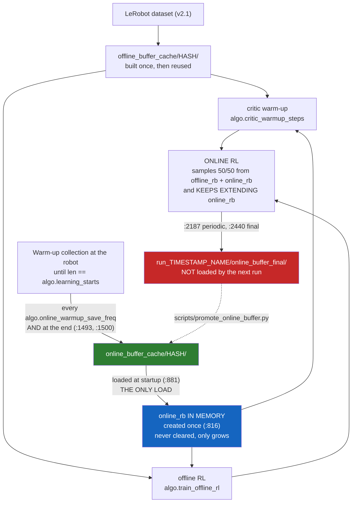

# Replay-buffer caches: where the data lives, and what invalidates it

Short reference for `train_residual_td3.py` on real hardware. Every line number
below was read off the file, not remembered.

---

## 1. The two caches

```
<repo>/offline_buffer_cache/<hash>/     built from the LeRobot dataset
<repo>/online_buffer_cache/<hash>/      collected from the robot during warm-up
```

Each `<hash>` is `sha1(json.dumps(meta, sort_keys=True))[:8]` of a metadata dict.
**Change any value in that dict and you get a different folder - and a fresh,
empty buffer that must be rebuilt or re-collected.**

Each cache folder holds a standard torchrl dump:

```
buffer_metadata.json          {"batch_size": N}
storage/storage_metadata.json {"len": <valid transitions>}
storage/meta.json             field shapes; shape[0] is algo.buffer_size
writer/metadata.json          {"cursor": N}
sampler/ , storage/*.memmap
user_metadata.json            the metadata dict this hash was computed from
```

`user_metadata.json` is the one that tells you *what config a cache belongs to*.
Read it when you are not sure which folder is which.

## 2. What changes the hash

### Offline (`train_residual_td3.py:1247-1277`)

| | |
| --- | --- |
| `task`, `wandb.name` | **yes, `wandb.name` is in the hash** |
| `offline_data.name`, `.root`, `.num_episodes` | |
| `offline_data.use_base_policy_for_base_actions` | |
| `offline_data.min_action_range`, `.min_state_std` | |
| `offline_data.reward_parquet`, `.reward_column`, `.remap_preset` | |
| `reward_shaping` | |
| `rl_camera` (as `image_keys`) | |
| `algo.n_step`, `algo.gamma` | |
| `algo.sampling_strategy` | + `priority_alpha`/`beta` if prioritized |
| `base_policy.wandb_id` | stays `"TODO"` on real hardware - unused but hashed |
| **`algo.batch_size` x `algo.offline_fraction`** | via `offline_batch_size` |
| `torchrl` / `tensordict` version | an env rebuild can invalidate caches |

### Online (`train_residual_td3.py:835-858`)

| | |
| --- | --- |
| `task`, `wandb.name` | **same trap** |
| `rl_camera` (as `image_keys`) | |
| `algo.n_step`, `algo.gamma` | |
| **`real_max_steps`** (as `horizon`) | |
| **`algo.learning_starts`** (as `size`) | |
| `algo.buffer_size` | |
| `algo.random_action_noise_scale` | |
| `offline_data.min_action_range`, `.min_state_std` | |
| `algo.sampling_strategy` | + `priority_alpha`/`beta` if prioritized |
| **`algo.batch_size` x `algo.offline_fraction`** | via `online_batch_size` |
| `torchrl` / `tensordict` version | |

### The two that bite in practice

* **`wandb.name`** - every script in a family must set the *same* value, or each
  one collects its own buffer. W&B still shows separate runs, because the run
  name is `{wandb.name}__{timestamp}__{hyperparams}__seed{N}`.
* **`algo.learning_starts`** - it is in the online hash. The Station-1 scripts
  use `15000` in one and `10000` in the other four, so they do **not** share an
  online buffer today.

`horizon` is safe across modes: it is `real_max_steps` whether
`algo.offline_pretrain_only` is true or false (`:789`, and `:519` sets the
training env's `max_steps` from the same value) - as long as `real_max_steps`
itself matches.

## 3. The flow



Read the colours as: **blue** is the single in-memory buffer, **green** is the
folder the next run reads, **red** is the folder it does not.

## 4. The part that surprises people

There is **one** online buffer in memory. It is created once at `:816`, loaded
once at `:881`, and never cleared or recreated - verified: no reassignment, no
`.empty()`, no `.clear()`. During online RL it keeps growing, and the 50/50
sampling draws from that same buffer, which still holds every warm-up
transition. **Nothing is discarded while a run is going.**

But the two *disk* writes that target `online_buffer_cache/<hash>/` both sit
**inside** the `if len(online_rb) < algo.learning_starts:` warm-up block. Once
warm-up finishes, that block never runs again, so the hashed folder stops being
updated. From then on the buffer is only written to `run_<...>/online_buffer_*`,
and that is never loaded.

So:

| | |
| --- | --- |
| during a run | nothing is lost; online RL samples the full buffer |
| across runs | the next run loads only what the hashed cache has - i.e. the warm-up data |

That is a persistence gap, not a training bug.

## 5. Carrying a session forward

```sh
# dry run (default - writes nothing)
.venv/bin/python scripts/promote_online_buffer.py \
    --from run_2026-10-01_.../online_buffer_final --to <hash>

# do it; the old cache is MOVED aside, never deleted
.venv/bin/python scripts/promote_online_buffer.py \
    --from run_2026-10-01_... --to <hash> --apply
```

`--from` takes the run folder (it picks `online_buffer_final`, falling back to
`online_buffer_latest`) or the dump directory itself. `--to` takes the 8-char
hash or a full path.

It **replaces** rather than appends, on purpose:

1. the run's dump is not a delta - it is the same buffer, loaded from the cache
   at startup and then extended, so it already contains the cache's contents;
   appending would store the warm-up transitions twice;
2. the dumped rows are already post-`MultiStepTransform`, which is an *inverse*
   (write-time) transform - pushing them back through `extend()` would apply the
   n-step collapse a second time.

Guards: it refuses when the source has fewer transitions than the destination,
warns when `algo.buffer_size` differs between the two, preserves the
destination's `user_metadata.json` (the record of which config the hash belongs
to), and keeps the previous cache as `<dest>.bak-<timestamp>`.

### The buffer is circular - what that costs you

The storage is `LazyTensorStorage(max_size=algo.buffer_size)` (`:817`), which is
**circular**. Once it holds `algo.buffer_size` transitions - 70,000 in the
Station-1 configs - every new transition **overwrites the oldest**.

The warm-up / population data goes in first, so it is evicted first:

| total collected | what the buffer holds |
| --- | --- |
| below `buffer_size` | everything, population data included - promoting is lossless |
| above `buffer_size` | only the most recent `buffer_size` transitions; the original population data is **already gone**, evicted in memory during training |

So after a long online-RL session, `online_buffer_final` no longer contains the
data you stood at the robot to collect, and promoting makes the cache match that.
**This is the circular buffer doing what it was configured to do** - the eviction
happened during training, not during promotion - but it means:

* the promoted cache is a **window of the most recent `buffer_size` transitions**,
  not an archive of everything ever collected;
* to keep the original population buffer, keep the `<dest>.bak-<timestamp>`
  folder the script leaves behind, which is the pre-promotion cache;
* raising `algo.buffer_size` avoids the eviction, but `buffer_size` is itself in
  the online cache hash (section 2), so changing it starts a new, empty cache and
  you collect from scratch.

## 6. Do not lose the run folder

`:2446-2456` runs `shutil.rmtree(run_cache_dir)` when `no_cleanup` is false -
deleting the checkpoints **and** `online_buffer_final`. Every Station-1 script
sets `NO_CLEANUP="true"`. Keep it that way.

## 7. Related

* `scripts/TrossenStation1Real/BUFFER_POPULATION_ARCHITECTURE.md` - what actually
  goes into a transition, offline and online, with the `MultiStepTransform` FIFO
  and the `terminated` vs `buffer_done` split.
* `scripts/inspect_replay_buffer.py` - inspect either cache.
