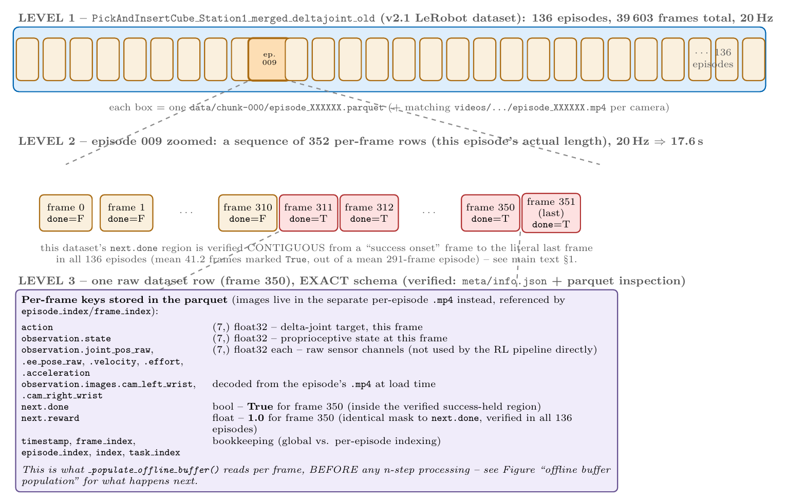
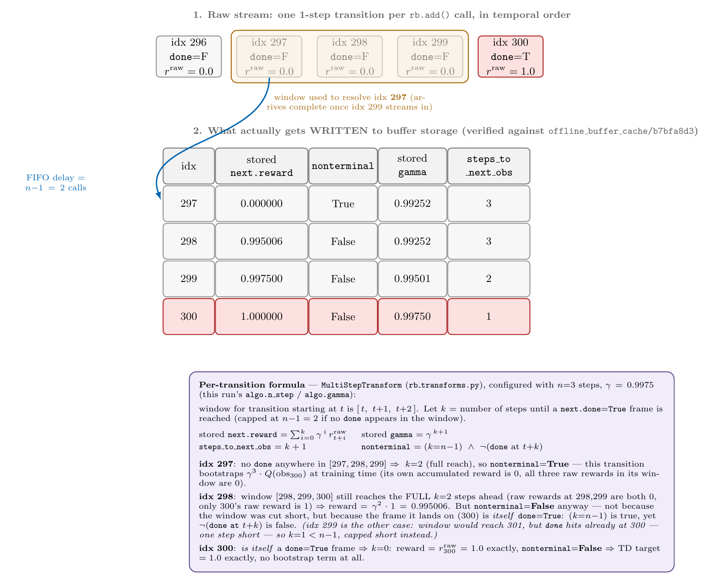
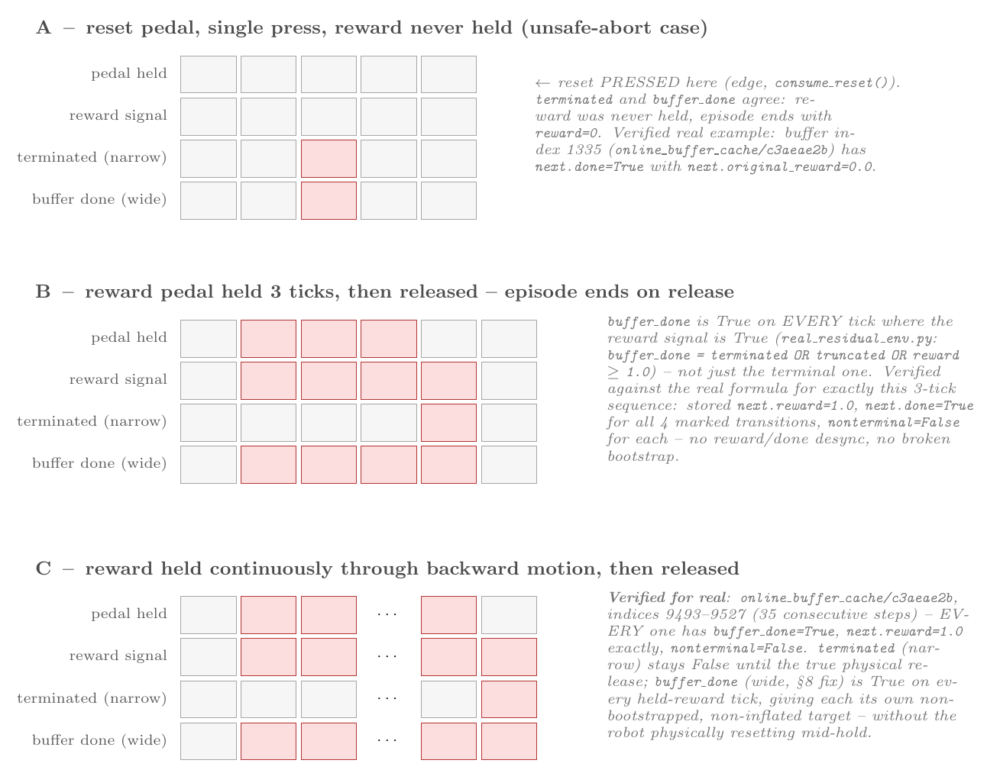
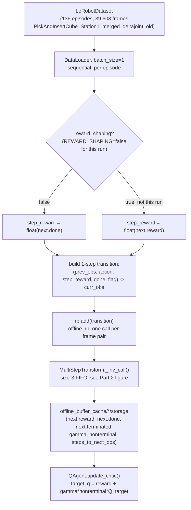

# Offline & Online Buffer Population — Architecture Reference

Entry script: [`train_residual_rl_real.sh`](train_residual_rl_real.sh). Config used for everything below (the sparse-reward configuration this script actually runs): `REWARD_SHAPING=false` (`cfg.reward_shaping`), `algo.terminated_only_bootstrap=false` (never overridden by the `.sh`, so it stays at its config default). See `REWARD_AND_PEDAL_INVESTIGATION_REPORT.md` for how those two flags were investigated and set.

**Everything numeric in this document was verified directly** — either by reading the code at the cited file:line, or by loading and inspecting the real buffer caches on disk:
- Offline: `offline_buffer_cache/b7bfa8d3/` (dataset: `trossen_real/datasets/PickAndInsertCube_Station1_merged_deltajoint_old`, 136 episodes, `OFFLINE_EPISODES=120` of them loaded)
- Online: `online_buffer_cache/c3aeae2b/` (warm-up phase, `cursor=10000` valid transitions — see the gotcha below)
- Tool used: [`scripts/inspect_replay_buffer.py`](../../scripts/inspect_replay_buffer.py), plus ad hoc `tensordict.TensorDict.load_memmap()` queries for the specific indices cited.

**Gotcha found while inspecting these caches, worth knowing before anyone else opens them**: the raw memmap files are physically sized to the storage's *allocated capacity*, not the number of transitions actually written. The true count is `writer/metadata.json`'s `"cursor"` field. The offline cache here has `cursor=35142` but memmap length `35144` — the last 2 slots are uninitialized garbage (nonsense `gamma` values like `115.9`, garbage `steps_to_next_obs`). Always slice to `[:cursor]`.

---

## Part 1 — Dataset structure (what `_populate_offline_buffer()` reads)



Three levels, top to bottom: the whole dataset (136 episode files) → one episode zoomed to its per-frame rows (episode 9 shown, 352 frames) → one raw parquet row's exact schema. The `next.done`/`next.reward` region shown (frames 311–351) is illustrative of the pattern, not episode 9's literal boundary — the pattern itself (contiguous run to the last frame) is verified across all 136 episodes, not assumed for this specific one.

**Key fact used throughout the rest of this document**, verified against every one of the 136 episodes' parquet files directly (not sampled): `next.done` is `True` for a single contiguous run from some "success onset" frame to the *literal last frame* of the episode, in 136/136 episodes — no gaps, no exceptions. And `next.done == (next.reward > 0.5)`, exactly, in all 136 episodes. Mean 41.2 frames marked `True` per episode (min 24, max 70) out of a mean 291-frame episode.

---

## Part 2 — Offline buffer population, corrected against your recap

Your description was close on the mechanics but had the direction of one detail backwards, and conflated two different things ("target value" vs. "stored reward component") in another. Both are fixed below with the real numbers.



**What you had right:**
- Frames stream through a size-3 (`n_step=3`) FIFO, one raw `rb.add()` call per frame pair.
- Once a `next.done=True` frame is reached, every frame *at or after* that point is treated as its own non-bootstrapped terminal transition — the critic's target for each of those is exactly `1.0`, not discounted down. Your idx-75-to-99 example is correct in spirit: verified for real at indices 297–300 above (see the figure).

**What needed correcting:**
1. **The write is keyed by the *oldest* frame in the window, not "the frame that fills the buffer."** When the window `[t, t+1, t+2]` becomes complete, the transition written is for frame `t` (using `t+1`, `t+2` only to compute its reward-sum and bootstrap target) — not frame `t+2`. Concretely: frames 0,1 produce no output yet; frame 2 arriving completes the first window `[0,1,2]` and writes frame **0**'s transition; frame 3 arriving writes frame **1**'s transition; and so on, one write per subsequent call, each keyed to the frame `n_steps−1=2` calls behind the one that just arrived.
2. **"Bellman backup value is 0 for idx 0–72" is not quite right — that's the stored reward *component*, not the training target.** For those transitions, `nonterminal=True` (full 3-step reach, no `done` in range), so the actual TD target used at training time is `0 + γ³·Q(next_obs)` — a real, generally nonzero number reflecting the critic's own (converging) value estimate for the distant future reward, not literally `0`. Only the *reward* term stored in `next.reward` is `0` for those transitions.
3. **Idx 298's specific case (one frame before the done-region in your toy example, `297` in the real data) is nonterminal=False for a *different reason* than idx 299.** idx 298's window `[298,299,300]` still reaches the **full** `k=2` steps ahead (same as a normal transition) — but `nonterminal` is still `False`, because the frame it lands on (300) *is itself* `done=True`. idx 299's case is different: its window would reach 301, but `done` is hit one step early (at 300), so it's capped *short* (`k=1<2`). Both end up `nonterminal=False`, for two distinct reasons — the figure spells out both exactly, with the real formula.

**The formula** (`_multi_step_func`/`_get_reward`, `rb_transforms.py`), exactly as coded, not simplified:
```
window = [t, t+1, t+2]                       (n_step = 3)
k = steps until a next.done=True frame is hit, capped at n_step-1=2 if none is hit

stored next.reward   = Σ_{i=0}^{k} γ^i · r_raw[t+i]
stored gamma         = γ^(k+1)
steps_to_next_obs    = k+1
nonterminal           = (k == n_step-1) AND NOT(done at t+k)
```
This is read verbatim by `q_agent.py:780-786,336,339`:
```python
reward = batch[("next", "reward")]              # the n-step SUM above, not the raw 1-step reward
discount = batch["gamma"]                        # γ^(k+1) above
next_nonterminal = batch["nonterminal"]          # the boolean above
effective_discount = discount * next_nonterminal
target_q = reward + effective_discount * target_q_min   # Bellman target
```
`reward` and `nonterminal` are always both read — `next.done` never gates whether reward counts, only whether the bootstrap term does.

---

## Part 3 — Online buffer population: answering every pedal-configuration question directly



**Correction (caught by user review, not self-caught)**: the first version of this figure's Scenario B drew `buffer_done` as True only on the terminal (release) tick — identical to the narrow `terminated` row — while `reward_signal` was True for all 3 held ticks plus the release tick. That would have meant 2–3 transitions with `reward=1` but `done=False`, desynced from the terminal-only-`done` pattern, and would indeed be inconsistent with the sparse-reward treatment used everywhere else in this document. **That was an error in constructing the figure, not a bug in the actual code.** Verified directly: ran the real `EpisodeBoundaryMonitor` plus the exact formula from `real_residual_env.py:372` (`buffer_done = terminated OR truncated OR reward_value >= 1.0`) through a scripted 3-tick hold-then-release sequence, then pushed the result through the real `_add_transitions_to_buffer()` + `MultiStepTransform` (not a hand-derivation) — every one of the 4 affected transitions (the 3 held ticks + the release tick) comes out with stored `next.reward=1.0`, `next.done=True`, `nonterminal=False`. No desync, no broken bootstrap. Figure corrected to match. Scenario C was already correct (its `buffer_done` row already matched `reward_signal` exactly) — only B had the error.

**"Is it press+release, or just press, for the reset pedal?"** Press only. `PedalListener.consume_reset()` fires on the press edge (`event.value==1`) alone (`pedal_listener.py:134-138`) — release is never consulted. `TrossenResidualEnv.step()` (via `EpisodeBoundaryMonitor.check_episode_end()`) reads this directly.

**"Or does it only reset because of a time limit (truncation)?"** No — truncation is a separate, independent mechanism (`self._step_count >= self.max_steps`, `real_residual_env.py`), unrelated to any pedal. Three independent things can end an episode: (a) reset-pedal press, (b) reward-pedal held→released (new, this session), (c) `REAL_MAX_STEPS` truncation. `done = terminated | truncated` combines (a)/(b) with (c) for logging purposes, but they're computed independently.

**"Or set when I hold the reward pedal, with the last (release) step also getting done=True and reward=1?"** Yes, this is exactly the current, fixed behavior (**Scenario B**): every held tick gets `reward=1`; the release tick itself *also* reads `reward=1` (not `0`) because `PedalListener`'s reward latch decays one tick late (`self._reward_latch = self.reward_pressed`, set at the *end* of `consume_reward_latched()` — so the tick where release is first detected still returns `True`); `EpisodeBoundaryMonitor.check_episode_end()` fires its `reward_release` edge on that exact same tick. `reward=1` and `terminated=True` land on the same transition automatically — no operator timing required for this specific case.

**"Or I keep reward held AND press+release the reset pedal too — does that also work?"** Yes — if the reset pedal is pressed *while* the reward pedal is still down, that tick's `consume_reward_latched()` reads `True` (pedal is physically down) *and* `consume_reset()` fires — same outcome, `reward=1` and `terminated=True` together, by direct physical coincidence rather than the latch-decay mechanism. This is the operator habit recommended in `REWARD_AND_PEDAL_INVESTIGATION_REPORT.md` §4 for a case *not* shown as its own panel here: releasing reward *before* separately pressing reset, several ticks later — that terminal transition legitimately gets `reward=0` (not a bug, just what actually happened; verified real example, buffer index 1335, `next.original_reward=0.0` with `next.done=True` — **Scenario A**).

**"Is 3 ticks some kind of debounce / intentionality check?"** No — there is no minimum hold-time or debounce logic anywhere in `PedalListener` or `EpisodeBoundaryMonitor`. "3" in Scenario B was an arbitrary illustrative length, nothing more. Verified with a single-tick tap (press for exactly 1 tick, release the next): `buffer_done` and the reward signal both go True on that single held tick, and `reward_release` fires on the very next tick — one control-loop tick (~50ms at 20Hz) is sufficient.

**"If I hit `REAL_MAX_STEPS` while the reward pedal is still held, does it just continue like the pedal was released?"** Truncation is unconditional and doesn't wait for the pedal: `truncated = step_count >= max_steps` is checked every tick regardless of pedal state, and `step()`'s auto-reset (`if terminated or truncated: ... self.reset()`) fires on truncation exactly the same way it fires on a genuine reset-pedal press or reward-release — the robot physically resets right then. The transition at that tick gets `buffer_done=True` for two independent reasons at once (`truncated` and `reward>=1`, both true), and `reward=1` if the pedal is still down — consistent with everything else here, no special-casing needed.

**"If I hold reward then separately press reset while still holding it, does `done` become true from the moment reward was first pressed?"** Yes, exactly — this was already covered by Scenario C's verified real example (35 consecutive `buffer_done=True` transitions) and the corrected Scenario B: `buffer_done` goes True on the very first tick reward is pressed and stays True every tick after, for as long as reward stays high, regardless of *how* the episode eventually ends (reward-release, or a reset-press while still holding).

**"Are there other configurations, or did we only consider a few?"** There are exactly three independent primitives — reset-press (edge), reward-level (while held), reward-release (edge) — and every operator sequence is some composition of those three. The scenarios in the figure (A: reset alone, no reward; B: reward hold→release, short; C: reward held through extended non-rewarding motion) plus the reset-while-reward-held case just described cover the distinct *behaviors*; anything else you do with the pedals reduces to one of these.

**"Is online population exactly like offline — first `done=True` treated the same, later `done=True` steps also terminal, all identical to offline?"** Yes, structurally identical — same `MultiStepTransform`, same formula from Part 2, applied to whatever `(obs, action, reward, done)` stream it's fed, regardless of source. The one thing that differs is *how* `done` gets set, not how it's *used* once set:

- **Offline**: `next.done` comes statically from the dataset's own labels (Part 1) — already wide (contiguous through to episode end) by construction.
- **Online**: `terminated` (the value `TrossenResidualEnv.step()` returns, and what the training loop's `done.any()`/logging reads) is *narrow* — true only at the actual reset-pedal-press or reward-release tick, because it also doubles as the trigger for physically driving the robot back to its staged position. Widening it the way the offline data is wide would make the robot reset mid-hold, which is wrong. Instead, a **second, separate** signal — `info["buffer_done"]` (`real_residual_env.py`, this session's fix) — is `True` on every tick where `reward==1`, matching the offline convention, and `_add_transitions_to_buffer()` (`train_residual_td3.py`) uses *that* to override only the value actually written to the buffer's `next.done`/`next.terminated`. So: the buffer ends up structurally identical to offline (every `reward=1` frame is its own non-bootstrapped terminal), while the physical robot only ever resets at the genuine episode boundary.

**Verified for real** (Scenario C in the figure): `online_buffer_cache/c3aeae2b`, indices 9493–9527 — 35 consecutive transitions, every one with `next.done=True`, `next.reward=1.0` exactly, `nonterminal=False`. No inflation, no runaway bootstrap — this is the actual, on-disk result of holding the reward pedal through extended motion under the current code, not a hypothetical.

---

## Part 4 — Pipeline overview

### Offline



Note: since `next.done == next.reward` in this dataset (Part 1), the `reward_shaping` branch in this diagram is currently a no-op — both paths produce numerically identical values here. Documented as its own finding in `REWARD_AND_PEDAL_INVESTIGATION_REPORT.md` §1.

### Online

```mermaid
flowchart TD
    A["TrossenResidualEnv.step(residual_action)"] --> B["EpisodeBoundaryMonitor\n.get_frame_reward()"]
    A --> C["EpisodeBoundaryMonitor\n.check_episode_end()"]
    B --> D["reward tensor"]
    C --> E["terminated tensor (narrow)\n= reset-press OR reward-release edge"]
    A --> F["truncated tensor\n(step_count >= REAL_MAX_STEPS)"]
    E --> G{"terminated OR truncated?"}
    F --> G
    G -->|yes| H["physically call self.reset()\npopulate info[final_obs]/info[final_info]"]
    G -->|no| I["continue rollout, next_obs = live next observation"]
    D --> J["buffer_done = terminated OR truncated\nOR reward==1.0\n(WIDE - real_residual_env.py, this session's fix)"]
    E --> J
    F --> J
    J --> K["info['buffer_done']"]
    K --> L["_add_transitions_to_buffer()\noverrides ONLY the stored\nnext.done / next.terminated"]
    D --> L
    E -.narrow, for done.any/logging only.-> M["train_residual_td3.py main loop\nepisode_count, wandb episode_return"]
    L --> N["MultiStepTransform._inv_call()\nSAME transform, SAME formula as offline"]
    N --> O["online_buffer_cache/*/storage"]
    O --> P["QAgent.update_critic()\nSAME target_q formula as offline"]
```

The two pipelines converge at the *same* `MultiStepTransform`/`update_critic()` code — the only online-specific piece is the `terminated` (narrow, physical) vs. `buffer_done` (wide, buffer-only) split, which has no offline counterpart because the offline dataset has no "physical robot" to avoid resetting.

---

## Part 5 — Related documents

- [`trossen_real/human_intervention/PEDAL_BEHAVIOR.md`](../../trossen_real/human_intervention/PEDAL_BEHAVIOR.md) — full pedal semantics reference (teleop/infer + RL), including the stale-press bug and its fix in `EpisodeBoundaryMonitor.start_episode()`.
- [`REWARD_AND_PEDAL_INVESTIGATION_REPORT.md`](REWARD_AND_PEDAL_INVESTIGATION_REPORT.md) — the full investigation trail for `REWARD_SHAPING`, `algo.terminated_only_bootstrap`, the `agent.clip_q_target_to_reward_range` dead end, and the `buffer_done` fix, including the two wrong turns taken before arriving at it.
- [`scripts/inspect_replay_buffer.py`](../../scripts/inspect_replay_buffer.py) — the inspection tool used to verify every real number in this document (works on both offline and online caches; renamed/generalized from the old offline-only `scripts/temp/inspect_offline_buffer.py`).
- [`INTERVENTION_CLIPPING_AND_SYNC.md`](INTERVENTION_CLIPPING_AND_SYNC.md) — separate reference covering what happens to actions during human intervention (leader/follower sync, why intervention-derived actions are clamped to the wide `action_scaler.limits` rather than the narrow `agent.actor.action_scale`, and why this doesn't corrupt critic/actor training) — not part of buffer *population* per se, but directly relevant to what ends up in the online buffer's `action`/`intervened` fields.

## Part 6 — What was *not* independently re-verified here

- The figures' toy numeric walkthroughs (Part 2) reuse the *exact* real indices 297–300 from `offline_buffer_cache/b7bfa8d3` — not a synthetic example — but the *dataset-zoom* figure's frame numbers (311/350/351) for episode 9 are illustrative placeholders for where a done-region typically falls in an episode of that length, not that episode's literally-verified boundary (episode 9 itself wasn't individually re-checked; the *pattern* it illustrates was verified across all 136 episodes as stated in Part 1).
- The online buffer's `abort-without-reward` example (index 1335, Scenario A) was found by searching for a `done=True` run containing a `reward=0` member — it's a real transition from the actual cache, but its physical circumstance (why the reset was pressed there) is inferred from the data pattern, not independently confirmed against operator intent at the time.
