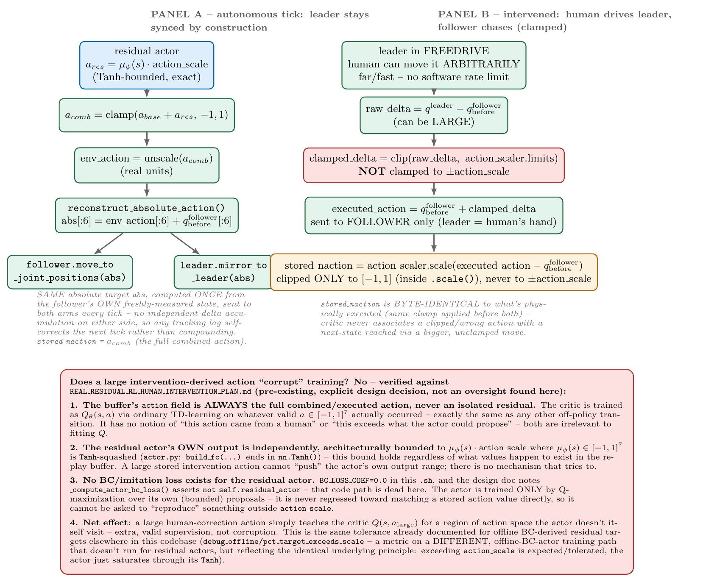

# Intervention, Action Clipping, and Leader/Follower Sync — Reference

Scope: exactly what happens to actions during human intervention on `TrossenResidualEnv`, why the "residual exceeds its normal range" case is safe rather than corrupting, and how the leader/follower arms stay synced. Everything below is derived directly from the actual current code (`trossen_real/rl/real_residual_env.py`, `trossen_real/inference/intervention.py`, `resfit/rl_finetuning/utils/normalization.py`, `resfit/rl_finetuning/off_policy/rl/actor.py`, `resfit/rl_finetuning/off_policy/rl/critic.py`, `resfit/rl_finetuning/off_policy/rl/q_agent.py`) and this exact entry script (`train_residual_rl_real.sh`) plus the real dataset's `meta/stats.json` — every number in §1 is computed from those two files, not asserted, and every mechanism claim is checked against a specific line of code, not a comment or a design doc.



## 1. Two different "scale" concepts, with the real numbers this `.sh` actually produces

There are two config values that both derive from the *same* `agent.actor.action_scale` (`ACTION_SCALE="[0.15,0.15,0.15,0.05,0.05,0.05,0.1]"` in the `.sh`), but they bound *different things in different unit spaces*, and the exact numeric gap between them can be computed directly from `trossen_real/datasets/PickAndInsertCube_Station1_merged_deltajoint_old/meta/stats.json`.

### 1.1 The raw inputs (from `meta/stats.json`'s `"action"` block, verbatim)

| dim | `action.min` | `action.max` |
|---|---|---|
| j1 | −0.080873 | 0.064088 |
| j2 | −0.202945 | 0.146105 |
| j3 | −0.161746 | 0.164034 |
| j4 | −0.167086 | 0.185397 |
| j5 | −0.086976 | 0.086213 |
| j6 | −0.329976 | 0.271992 |
| gripper | 0.004000 | 0.040000 |

And from the `.sh`: `ACTION_SCALE=[0.15,0.15,0.15,0.05,0.05,0.05,0.1]` → `agent.actor.action_scale`, `MIN_ACTION_RANGE=0.1` → `offline_data.min_action_range`, both fed into `ActionScaler.from_dataset_stats(action_stats, action_scale=cfg.agent.actor.action_scale, min_range_per_dim=cfg.offline_data.min_action_range)` (`train_residual_td3.py:408-411`).

### 1.2 The exact formula, applied by hand to one dimension (j6) before showing the full table

`ActionScaler.__init__` (`normalization.py:70-84`), literally, for one dimension:
```
action_mid[j6]         = (action_min + action_max) / 2        = (-0.329976 + 0.271992) / 2  = -0.028992
action_half_range[j6]  = (action_max - action_min) / 2        = (0.271992 - (-0.329976)) / 2 =  0.300984
min_half_range         = min_range_per_dim / 2                =  0.1 / 2                     =  0.05
action_half_range[j6]  = max(action_half_range[j6], min_half_range) = max(0.300984, 0.05)     =  0.300984   (floor not needed here)
expanded_half_range[j6]= action_half_range[j6] * (1 + action_scale[j6]) = 0.300984 * (1 + 0.05) = 0.316033
limits.min[j6]         = action_mid[j6] - expanded_half_range[j6]  = -0.028992 - 0.316033 = -0.345026
limits.max[j6]         = action_mid[j6] + expanded_half_range[j6]  = -0.028992 + 0.316033 =  0.287041
```
And separately, the actor's own bound for the same joint (`actor.py:181`, `scaled_mu = Tanh(...) * action_scale_tensor` — the Tanh output is exactly `±1` at saturation, so the actor's maximum possible *normalized* output for j6 is exactly `action_scale[j6] = 0.05`; converting that to the same real units as `limits` via `unscale()`'s formula (`real(x) = mid + x·expanded_half_range`, `normalization.py:123-141`): a normalized magnitude of `0.05` corresponds to a real-unit magnitude of `0.05 * 0.316033 = 0.015802` rad. Ratio: `0.316033 / 0.015802 = 20.0`, i.e. exactly `1/action_scale[j6] = 1/0.05 = 20`.

### 1.3 The full table, same formula applied to all 7 dimensions

| joint | `action_scale` | dataset half-range | floor-adjusted half-range | `expanded_half_range` (= `action_scaler.limits` half-width, real units) | `limits.min` | `limits.max` | actor's own real-unit bound (`action_scale × expanded_half_range`) | ratio = `1/action_scale` |
|---|---|---|---|---|---|---|---|---|
| j1 | 0.15 | 0.072480 | 0.072480 | 0.083352 | −0.091745 | 0.074960 | 0.012503 | **6.667** |
| j2 | 0.15 | 0.174525 | 0.174525 | 0.200704 | −0.229124 | 0.172284 | 0.030106 | **6.667** |
| j3 | 0.15 | 0.162890 | 0.162890 | 0.187324 | −0.186179 | 0.188468 | 0.028099 | **6.667** |
| j4 | 0.05 | 0.176242 | 0.176242 | 0.185054 | −0.175898 | 0.194209 | 0.009253 | **20.0** |
| j5 | 0.05 | 0.086595 | 0.086595 | 0.090925 | −0.091306 | 0.090543 | 0.004546 | **20.0** |
| j6 | 0.05 | 0.300984 | 0.300984 | 0.316033 | −0.345026 | 0.287041 | 0.015802 | **20.0** |
| gripper | 0.1 | 0.018000 | **0.05** (floored) | 0.055000 | −0.033000 | 0.077000 | 0.005500 | **10.0** |

Every column here is reproducible from just two files: `meta/stats.json` (min/max) and this `.sh` (`action_scale`, `min_action_range`) — computed with a standalone script exercising the exact same arithmetic as `ActionScaler.__init__`, not by hand.

### 1.4 Why the ratio column is *exactly* `1/action_scale`, algebraically, for any dataset

```
ratio = expanded_half_range / (action_scale · expanded_half_range) = 1 / action_scale
```
The `expanded_half_range` term cancels completely — it doesn't matter what the dataset's min/max are, or how large the resulting real-unit range is. The ratio between "how wide the whole action space is" and "how far the actor's own residual can reach within it" is fixed the moment `action_scale` is chosen, independent of the data. For this `.sh`: joints 1–3 → **6.667×**, joints 4–6 → **20×**, gripper → **10×**. That is the honest, exact size of the gap between what a human intervention can command and what the actor could ever produce on its own, for this specific run's configuration.

### 1.5 Worked numeric example — your "move the leader fast" scenario, joint 6

Say the human moves the leader by `+0.25` rad relative to the follower's current position, in one control tick (`period_s = 1/control.frequency_hz`, e.g. 50ms at 20Hz — well within what a fast hand motion can produce).

```
raw_delta[j6]        = q_leader[j6] - q_follower_before[j6] = 0.25                     (real_residual_env.py:287)
clamp bound          = [limits.min[j6], limits.max[j6]] = [-0.345026, 0.287041]        (§1.3 above)
clamped_delta[j6]    = clip(0.25, -0.345026, 0.287041) = 0.25                          (unclamped - inside the wide bound)
executed_action[j6]  = q_follower_before[j6] + 0.25
range[j6]            = limits.max[j6] - limits.min[j6] = 0.632066
stored_naction[j6]   = action_scaler.scale(0.25)                                       (normalization.py:102-121)
                     = 2 · (0.25 - limits.min[j6]) / range[j6]  -  1
                     = 2 · (0.25 - (-0.345026)) / 0.632066  -  1
                     = 2 · 0.595025 / 0.632066  -  1
                     = 1.8828  -  1
                     = 0.8828
```
(Verified by running this exact arithmetic in Python, not just by hand — `stored_naction[j6] = 0.8827931883...`.)

So the human's single 0.25 rad tick becomes a **normalized stored residual of ≈0.88** for j6 — compare to the actor's own maximum possible normalized output of **0.05** for that same joint. **The stored implied residual is `0.8828/0.05 ≈ 17.66×` the actor's own maximum reach, from a single tick.** This is not a hypothetical: 975 of 1113 real intervened transitions in `online_buffer_cache/c3aeae2b` exceed `action_scale` in at least one dimension this same way (§5 below).

## 2. Panel A — autonomous tick: why leader and follower can't drift apart

Traced exactly (`real_residual_env.py:304-316`, `policy_client.py::reconstruct_absolute_action`):

```
a_res   = μ_φ(s) · action_scale                          (Tanh-bounded, exact, actor.py:177-181)
a_comb  = clamp(a_base + a_res, -1, 1)
env_action = action_scaler.unscale(a_comb)                (real units)
abs[:6] = env_action[:6] + q_follower_before[:6]           (reconstruct_absolute_action)
```
`abs` (the same absolute joint target) is sent to **both** `follower.move_to_joint_positions(abs)` and `intervention.mirror_to_leader(abs)`. Critically, `abs` is computed from `q_follower_before` — the follower's own **freshly measured** state, not an accumulated running total on either arm. This is a self-correcting scheme by construction: if the leader lagged slightly behind on a previous tick (tracking latency, non-blocking motion not yet finished), the next tick's `abs` is still computed relative to the *follower's actual current position*, and the leader gets commanded to the same fresh absolute target again — any small lag doesn't compound into permanent drift. There's no separate "resync" step needed during ordinary autonomous operation because the two arms are never actually given independent commands to drift apart from in the first place.

`stored_naction = a_comb` — the full combined action, confirmed directly from the code (`real_residual_env.py:310`).

## 3. Panel B — intervened: the clip, and why it's the wide bound, not the narrow one

Traced exactly (`real_residual_env.py:280-303`):

```
raw_delta      = q_leader[:6] - q_follower_before[:6]          (can be LARGE — freedrive has no rate limit)
clamped_delta  = clip(raw_delta, action_scaler.limits.min[:6], action_scaler.limits.max[:6])
executed_action[:6] = q_follower_before[:6] + clamped_delta
executed_action[6]  = clip(q_leader[6], gripper_closed, gripper_open)     (hardware safety clip, separate)
```
The follower chases the leader, rate-limited to `action_scaler.limits` per tick (the WIDE bound) — not to `±action_scale` (the narrow one). `_to_stored_naction()` (`real_residual_env.py:491-498`) then computes:
```
raw = executed_action[:6] - q_follower_before[:6]
stored_naction = action_scaler.scale(raw)          # clips ONLY to [-1,1] internally (ActionScaler.scale, normalization.py:118)
```
Its own docstring states this explicitly: *"Only clipped to [-1,1] (via `action_scaler.scale()`), NEVER to `action_scale`."* And critically: the SAME clamp (`action_scaler.limits`) is applied *before* `move_to_joint_positions()` executes it — so `stored_naction` is always byte-identical to what physically happened. This specific mechanism exists to prevent a real, understood failure mode: if the stored value were clipped tighter than what was executed, the critic would learn `Q(s, a_stored)` paired with a `next_state` that was actually reached via a *different*, larger, unclamped `a_executed` — a genuine state/action/outcome mismatch. That's guarded against here by using one shared clamp for both.

## 4. Does a large intervention-derived residual corrupt training? — derived from code and math directly

Not "workable by design because a doc says so" — every claim below is either a direct grep/read of the current code or a derivation from the actual training math, redone from scratch.

### 4.1 Does the critic even see the base action? — checked, not assumed

Grepped every call site of the critic in `q_agent.py`:
```
q_agent.py:334  self.critic_target.q_value(next_obs["feat"], next_obs["observation.state"], next_action)
q_agent.py:377  self.critic(obs["feat"], obs["observation.state"], action)
q_agent.py:447  self.critic.q_value_for_policy(obs["feat"], obs["observation.state"], combined_action)
```
Every single one passes `obs["observation.state"]` — never `obs["observation.base_action"]`. `Critic.forward(self, feat, prop, act, ...)` (`critic.py:302`) only ever receives image features, raw proprioception, and the action being evaluated. `observation.base_action` is fed **only** to the actor (`actor.py:171-173`), never the critic. **The critic has no way to know a base action even exists** — it only ever sees `(image, state, 7D action) → value`. It cannot distinguish "this action came from a tiny actor residual" from "this action came from a large human override"; both are just a 7-dimensional number to it.

### 4.2 What the critic actually learns: a joint state-action value, not a rating of the action alone

`Q_θ(s, a)` — always both arguments together. The same numeric action means something different depending on `s`. This is the standard off-policy value-learning setup: the critic is trained by TD regression, `(Q_θ(s,a) - y)²`, on **whatever `(s,a,r,s')` transition actually occurred**, regardless of which policy (frozen base + actor residual, or a human's leader input) produced `a`. Off-policy learning is explicitly designed to learn from actions the *current* policy wouldn't itself generate — that's the entire premise of using a replay buffer at all, not something specific to intervention data.

### 4.3 The actor's update, the actual math, not a description of it

`update_actor` (deterministic policy gradient, TD3-style): the actor's parameters `φ` are updated by
```
∇_φ J(φ) = E_s [ ∇_a Q(s,a) |_{a = base(s) + π_φ(s)}  ·  ∇_φ π_φ(s) ]
```
Two things this says explicitly:
- **The gradient `∇_a Q` is evaluated at the actor's *own current output point*, `a = base(s)+π_φ(s)`** — never at the stored intervention action itself. There is no term of the form `‖π_φ(s) − a_human‖²` anywhere for a residual actor; `BC_LOSS_COEF=0.0` in this `.sh`, and `_compute_actor_bc_loss()` asserts `not self.residual_actor` — that path cannot even execute for this configuration. The actor is never told to imitate a stored value.
- **`π_φ(s) = Tanh(MLP(s)) · action_scale`** (`actor.py:177-181`) is bounded to `±action_scale` by construction, at every step of training and at inference — this is a permanent property of the network's output layer, not a training-time-only constraint. No amount of gradient signal can push `π_φ(s)` past its own `Tanh` saturation.

So mechanically: a large intervention action shapes where `Q` is high; the actor's gradient step only ever asks "which direction, from *my own current, bounded* position, increases `Q`?" and moves a small amount that way, still bounded. It is never handed the intervention action to copy.

### 4.4 The part that actually helps your optimistic reading: this is a repeated, closed-loop process

`base(s)` is re-queried fresh from the actual current follower state every single tick (`_query_base_action(follower_state_after, images)`, `real_residual_env.py:326`) — it is not a fixed plan computed once per episode. That means a correction a human makes in **one big tick** does not have to be matched by the actor's residual in **one tick**. The actor can apply its small, bounded residual **repeatedly**, each tick against the newly-updated state, and small steps in a consistent direction accumulate over the episode. The per-tick bound (`action_scale`) limits *instantaneous* correction size for safety; it does not limit *cumulative* correction achievable over many ticks (`REAL_MAX_STEPS=400` in this `.sh` — up to 400 such small steps available per episode).

### 4.5 What is *not* guaranteed — the honest caveat, not smoothed over

Two things stop this from being unconditionally "fine, no downside":

1. **No guarantee the cumulative small corrections actually close a given gap in time.** Whether they do depends on how many ticks remain in the episode and how far the base policy's own trajectory already needs to be pulled — this is a real-time, real-episode-length constraint, not a mathematical guarantee.
2. **The "useful gradient direction near the actor's own operating point" is not architecturally guaranteed — it's a generalization/calibration property of the critic network.** §4.1 established the critic has no way to distinguish where an action came from; that also means it must fit a single, shared `Q` surface across a potentially wide range of action magnitudes for similar states — dense near the actor's small residual, sparser and farther out near large interventions. If that surface doesn't generalize smoothly between the two regions, the *local gradient* the actor's update relies on (§4.3) can be a poor estimate, even though the actor itself can never be pushed outside its own bound by it. This is a standard risk in off-policy RL with heterogeneous behavior data, not something clipping to `action_scale` or `[-1,1]` prevents — it's mitigated in this run by ensembling/target-smoothing already in use (`NUM_Q_HEADS=10`, `MIN_Q_HEADS=2`, `TARGET_ACTION_NOISE=true`), not eliminated by them.

Net position: intervention data teaching the critic `Q(s, a_large)` for actions the actor can't itself reach is a *deliberate, structurally safe* mechanism (verified in §4.1–4.3, not asserted) — the actor cannot be forced outside its own bound, and cumulative small steps can plausibly close a gap a single large correction demonstrated (§4.4). But "totally fine, no downside" overstates it: whether the gradient direction it provides near the actor's actual operating point is *accurate* is a real, unresolved generalization question (§4.5), not a corruption mechanism, but not a non-issue either.

## 5. Empirical confirmation — real buffers, not just theory

`online_buffer_cache/c3aeae2b` turns out to already contain real intervention transitions (1113 of 10000 warm-up steps have `intervened=True`) — a genuine, unplanned opportunity to check §4 against actual data rather than just the code path. Using `scripts/inspect_replay_buffer.py --action-scale 0.15,0.15,0.15,0.05,0.05,0.05,0.1` (comparing the *implied residual*, `action − obs.observation.base_action`, against `action_scale` — comparing the raw combined `action` directly would be meaningless, since it's dominated by the base policy's own action, not bounded by `action_scale` at all):

| Buffer | Transitions with `|implied residual| > action_scale` in ≥1 dim | Autonomous (`intervened=False`) | Intervened (`intervened=True`) |
|---|---|---|---|
| `online_buffer_cache/c3aeae2b` | 975/10000 | **0/8887** | **975/1113** |
| `offline_buffer_cache/b7bfa8d3` | 4248/35142 | 4248/35142 (no intervention concept offline) | n/a |

This is exactly the predicted pattern: **zero** autonomous online transitions exceed `action_scale` (confirms §4.3 — the actor's own `Tanh`-bounded output genuinely never produces this on real data, not just in theory), while **88% of intervened transitions** do (confirms the human routinely commands corrections larger than the residual actor could itself produce — matching the §1.5 worked example against what actually happened on this station, not just a hypothetical). The offline figure (12% of transitions) is the same phenomenon from a different source (GT action vs. a *queried* base-policy prediction, unrelated to the actor network) — the real-data equivalent of what `debug_offline/pct_target_exceeds_scale` measures on the (inactive, for residual actors) offline-BC path.

## 6. What was *not* re-verified here

- §4.3 states the actor's *mean* output `π_φ(s)` is exactly `Tanh`-bounded to `±action_scale`, always. The actual *sampled* action used during training exploration adds Gaussian noise on top (`TruncatedNormal.sample()`, `utils.py:170-182`, clipped only to the overall `[-1,1]` bound via `clip=stddev_clip`), so in principle a single sampled autonomous action could drift slightly past `action_scale` by an amount bounded by `stddev_max`/`stddev_min` (`~0.015-0.03` in this `.sh`, small relative to `action_scale`). This was reasoned through analytically, not by running the actual sampling code — §5's real 0/8887 count for autonomous transitions is consistent with it staying negligible in practice, but the *sampling* distribution itself wasn't separately measured.
- No manual, physical walkthrough of an actual intervention session was performed by a human for this document — §5's confirmation comes from a warm-up run's buffer that happened to already contain real intervention transitions, not a fresh session run specifically for this investigation.

## Possible follow-ups (not implemented, just noted)

- Add a metric analogous to `debug_offline/pct_target_exceeds_scale` for the *online* buffer specifically (e.g. logged periodically during training), if you want ongoing visibility into this without having to manually run `inspect_replay_buffer.py` after the fact.
- `scripts/inspect_replay_buffer.py --action-scale ... --around <idx>` can show the exact per-step transitions around any specific intervened index if you want to eyeball a real correction's magnitude directly.
