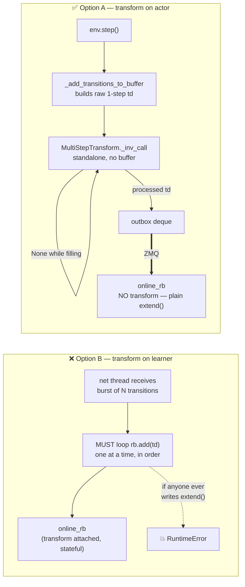
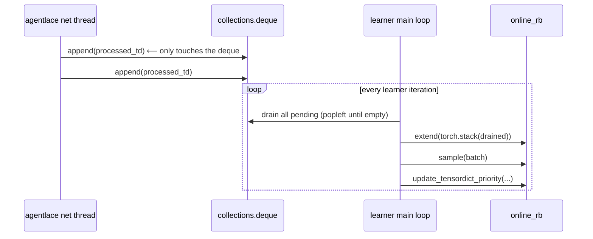
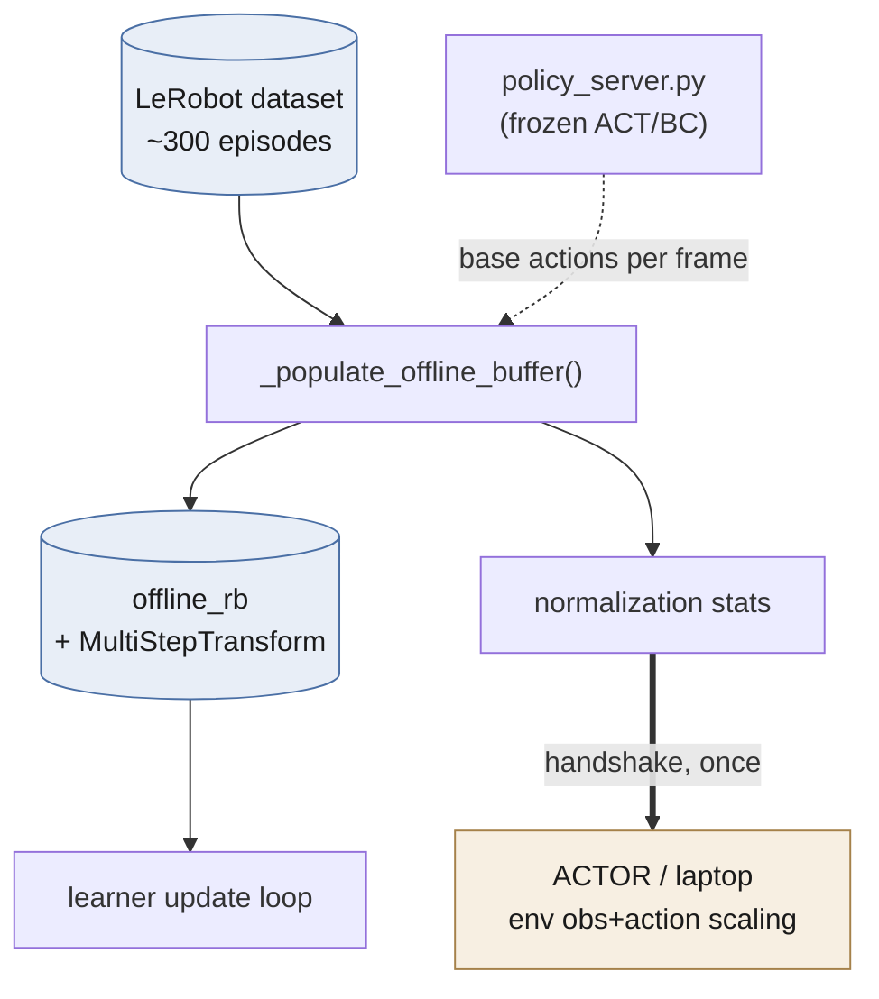
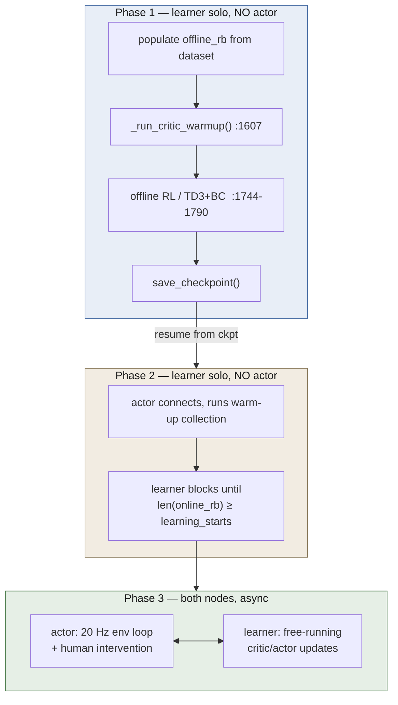
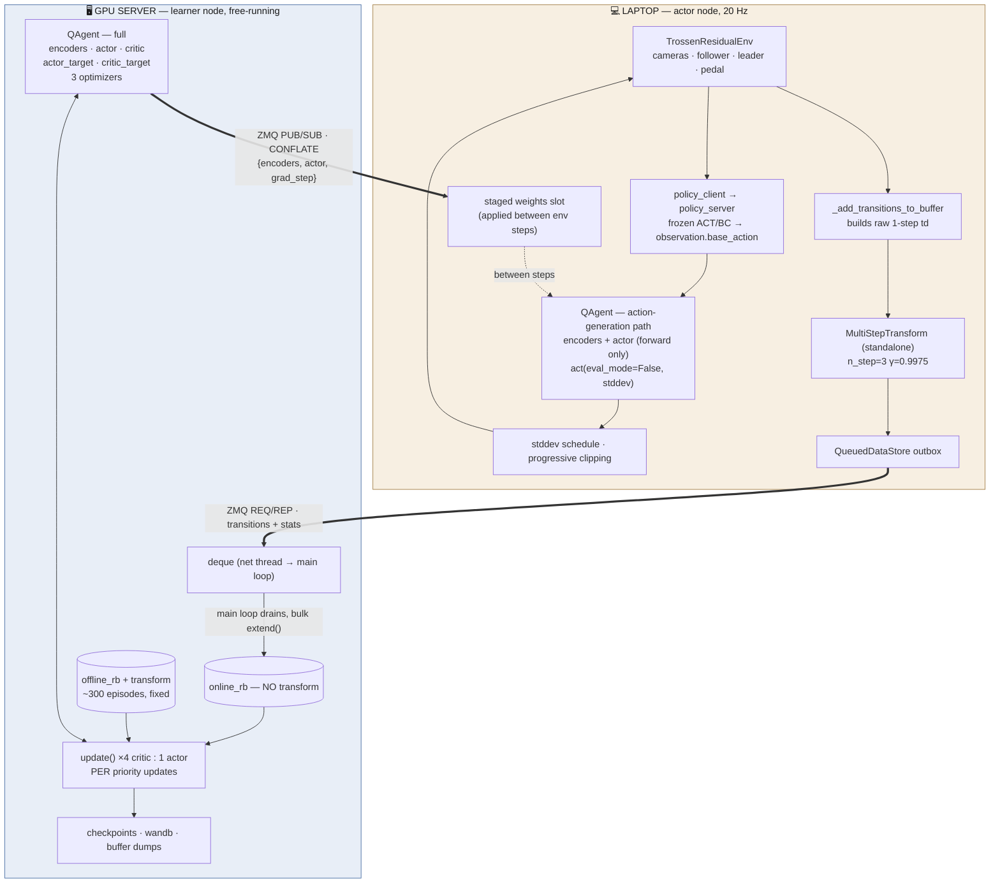

# ResFiT → distributed actor/learner: migration plan

Companion to `hil-serl/ARCHITECTURE.md` (which reverse-engineers HIL-SERL). This one is
about **our** code: what changes in `resfit/rl_finetuning/scripts/train_residual_td3.py`
and around it.

Ground rule for the whole document: **the algorithm, the config surface, and the phase
flow do not change.** Same `TrainConfig`, same shell scripts, same n-step math, same
UTD 4:1, same buffers, same checkpoint/resume story. Only *where the code runs* changes.

Everything below was verified against the actual code and, where it mattered, by running
it. Claims that came from execution are marked **[tested]**.

---

## 0. Answers to your questions, up front

| # | Question | Answer |
|---|---|---|
| 1 | Where does the n-step transform happen? | **On the actor.** Not because the learner *can't* — it can — but because our `MultiStepTransform` is a modified copy that only works with one-at-a-time `add()`, and `extend()` **hard-errors** on it. Details in §1. |
| 2 | Do we need a separate thread for it? Race conditions? | **No extra thread.** Network thread → `deque` → learner main loop drains it. See §2. |
| 3 | Does agentlace need JAX? | **No.** Core agentlace pulls in zero JAX/TF/Torch — proven by import-graph test. §3. |
| 4 | "QAgent inference half" — did you mean eval? | No — poor wording on my part. I meant the **action-generation path used during training**, noise and all. §4. |
| 5 | Where does the offline dataset live? | **Server.** The laptop needs only the normalization stats, shipped at handshake. §5. |
| 6 | Online-buffer warm-up loop — actor side? | Yes, loop on actor, buffer on learner. §6. |
| 7 | Can we run the offline-RL phase with no actor? | **Yes, and it's a genuine win.** Your `..._continue_from_offlineRL.sh` flow already does this. §7. |
| 8 | What do `update_every_n_steps` / UTD mean? | Your reading is right; one correction about what changes after the split. §8. |
| 9 | Is the ViT frozen? | **No — the opposite.** I was unclear. `FREEZE_ENCODER="false"` means it *is* trained. §9. |

---

## 1. The n-step transform — the most important finding

### What our transform actually is

`resfit/rl_finetuning/utils/rb_transforms.py` is a **modified copy** of
`torchrl/envs/transforms/rb_transforms.py`. Diffed against the installed torchrl 0.9.2,
two differences matter:

```python
# upstream torchrl                      # ResFiT
if total_cat.shape[-1] > self.n_steps:  if total_cat.shape[-1] >= self.n_steps:
    ...                                     ...
    return out[..., : -self.n_steps]        return out[..., -self.n_steps]
#          ^^^^^^^^^^^^^^^^^^ a SLICE                  ^^^^^^^^^^^^^^ a single INDEX
```

Upstream returns **every** transition that has become fully resolved (designed for
`extend()` with rollouts). Ours returns **exactly one** — it is hard-specialized to
`rb.add()` called one transition at a time, which is exactly how
`_add_transitions_to_buffer()` uses it (`train_residual_td3.py:240`).

Three more properties worth stating explicitly, because the whole design hangs on them:

- It is an **inverse** transform: it fires on **write**, not on sample.
- It is **stateful**: `self._buffer` is a FIFO of the last `n_steps` transitions.
- It therefore requires transitions to arrive **in strict temporal order from one env**.

### What I tested

```
A) add() one at a time, n_steps=3, 10 transitions      [tested]
   add(0)→len 0   add(1)→len 0   add(2)→len 1  ...  add(9)→len 8
   (first n_steps-1 are held back in _buffer — this is today's behaviour)

B) extend() with those same 10 as one batch            [tested]
   RuntimeError: expand_as_right requires the destination tensor to have
   less dimensions than the input tensor, got tensor.ndimension()=1 and
   dest.ndimension()=0
   → NOT a silent data loss. A hard crash, because out[..., -n_steps] is
     0-dim and the PER writer can't broadcast priorities onto it.

C) add() in two bursts of 5 (simulating network arrival) [tested]
   burst1 → len 3, burst2 → len 8. Identical to the contiguous case:
   the transform's state survives bursty arrival just fine.

D) running the transform STANDALONE, with no ReplayBuffer at all  [tested]
   t = MultiStepTransform(n_steps=3, gamma=0.99, use_terminated_for_bootstrap=True)
   out = t._inv_call(td)        # -> processed TensorDict, or None while filling
   10 raw in → 8 processed out. Adds keys: gamma, nonterminal, steps_to_next_obs.
   3-step reward checked: 2.9701 == 1 + 0.99 + 0.99²  ✓

E) pickle those 8 → zlib → unpickle → extend() into a NO-transform buffer  [tested]
   len == 8, sample() works. Lossless bulk insert.
```

### Decision: transform on the **actor**



Why A:

1. **The transform's precondition is strict temporal contiguity of one env's trajectory.**
   Only the actor can guarantee that by construction. On the learner it becomes a
   property of the network layer that you must preserve forever.
2. **It makes the learner's insert path stateless and bulk.** `rb.extend(stacked)` on a
   no-transform buffer — one call per burst instead of an N-iteration `add()` loop, and
   nothing on the learner holds hidden per-trajectory state. **[tested, E]**
3. **It removes a permanent landmine.** With the transform on the learner, the *natural*
   thing to write — `extend()` — crashes. Someone will write it.
4. It's free on the laptop: n_steps=3, a 3-deep FIFO of tiny tensors plus 84×84 images.
5. Marginally less wire traffic (the last `n_steps-1` are always held back).

**Cost of A:** the actor now needs `n_step`, `gamma`, `terminated_only_bootstrap` from
config. It already loads the same config object, so this is nothing.

**Unchanged:** `offline_rb` keeps its own `MultiStepTransform` instance on the learner —
it's populated locally from the LeRobot dataset in trajectory order, exactly as today.

**Implementation note:** standalone `_inv_call` returns a **0-dim** TensorDict
(`batch_size=torch.Size([])`). Call `.unsqueeze(0)` before stacking for the bulk
`extend()`. **[tested]**

---

## 2. Threading — no extra thread, and no locks to reason about

You asked whether a separate thread doing the insert would race with the main loop
sampling. Two facts:

- torchrl's `ReplayBuffer` **is** internally locked: `self._replay_lock = threading.RLock()`
  plus a `_write_lock`, taken by `add()`, `extend()`, `_sample()`, `__getitem__`,
  `__setitem__` (`torchrl/data/replay_buffers/replay_buffers.py:266, 725, 791, 1534`).
  So we're better off than HIL-SERL, which had to bolt its own `Lock` onto the jaxrl
  buffer (`serl_launcher/data/data_store.py:57`).
- But `update_tensordict_priority()` → `update_priority()` on the PER sum-tree is *not*
  obviously under that same lock, and our main loop calls it every update
  (`train_residual_td3.py:2251-2271`).

Rather than audit torchrl's sum-tree for thread safety, sidestep it:



`deque.append` / `popleft` are atomic under the GIL, so the handoff needs no lock. **All
torchrl mutation stays on one thread.** This is your instinct #2 from the question —
drain first, then sample — and it is the right one. Cost is a few hundred microseconds
per iteration for a bulk `extend()`.

This also answers the "do we recompute discounts for everything in the buffer?" worry:
**no**. The n-step math is per-transition and already done on the actor (§1). Nothing is
ever recomputed over the buffer.

---

## 3. agentlace does **not** need JAX

Your concern was right to raise and the answer is clean. Import-graph test run in the
`residual` (torch) env, importing only what we'd actually use:

```python
from agentlace.trainer import TrainerServer, TrainerClient, TrainerConfig
from agentlace.data.data_store import QueuedDataStore, DataStoreBase
```

```
jax/tf/torch/gym pulled in by core agentlace: NONE          [tested]
3rd-party top-levels: agentlace, cv2, numpy, pickle, zmq, lz4, threading, ...
```

Why it's structurally safe, not accidentally safe:

- `agentlace/setup.py` `install_requires` = `zmq, typing, typing_extensions,
  opencv-python, lz4, gym>=0.26.0`. **No jax.**
- `agentlace/data/__init__.py` is an **empty file**, so `import agentlace.data` pulls
  nothing transitively.
- JAX/TF appear only in **optional adapters** nothing in our path imports:
  `data/jaxrl_data_store.py`, `data/tfds.py`, `data/rlds_writer.py`,
  `data/tf_agents_episode_buffer.py`.
- `data/sampler.py` and `data/trajectory_buffer.py` wrap their jax imports in
  `try/except ImportError`.
- The README's JAX mention is scoped to one demo, `examples/async_learner_actor.py`,
  which uses `jaxrl_m`. Not the library.

You were right about *why*: it is a transport layer. `publish_network(payload: dict)`
pickles a dict. `QueuedDataStore.insert(data: Any)` appends to a deque. It never inspects
what it's moving.

### Install notes (concrete)

- **`lz4` is not installed in the `residual` env** — confirmed by `ModuleNotFoundError`
  while testing. Needed: `pip install pyzmq lz4`.
- Install agentlace with **`pip install -e . --no-deps`**. Its `install_requires` lists
  `zmq` (a PyPI shim, not the real `pyzmq`) and `gym>=0.26.0`, which we do not want
  anywhere near our gymnasium setup. The core needs only `pyzmq` + `lz4` (+ `numpy`).
  `opencv-python` is only used by `mat_to_jpeg`/`jpeg_to_mat` helpers we never call.

Verdict: **vendor or `-e` install it as-is.** Do not rewrite it. It is ~500 lines of
pure-Python ZMQ and it already handles the two things that are annoying to get right —
the `CONFLATE` latest-wins weight socket and the resume cursor.

---

## 4. "QAgent inference half" — clarified

Bad wording in the earlier doc. I did **not** mean eval/deployment. I meant: *the subset
of `QAgent` code that produces an action during training-time data collection* —

```python
stddev = utils.schedule(cfg.algo.stddev_schedule, global_step)   # :1976
action = agent.act(obs, eval_mode=False, stddev=stddev, cpu=False)  # :1977
```

`eval_mode=False` → `_act_default` takes the `dist.sample(clip=...)` branch
(`q_agent.py:299`), i.e. **deterministic actor + TruncatedNormal exploration noise**.
That is exactly what stays on the laptop, noise and all, behaving exactly as today. The
standalone pure-inference script is a separate, later thing and you're right that it
needs none of this architecture. In §11 I call this the **action-generation path**.

---

## 5. Offline dataset & `_populate_offline_buffer` → server

**The LeRobot dataset lives on the GPU server.** The laptop never needs it.

`_populate_offline_buffer()` (`train_residual_td3.py:968`) queries the frozen BC/ACT
policy for each demo frame's base action (rather than using the dataset's own action).
On the server that means the server needs a base-policy endpoint. Two options:

- **(a, recommended)** run a second `policy_server.py` on the GPU server, same frozen
  checkpoint. It has a GPU; this is easy and keeps the offline path self-contained.
- **(b)** populate once anywhere and rely on the existing hash-keyed cache
  (`OFFLINE_CACHE_DIR`, `optimized_replay_buffer_dumps/loads`, `train_residual_td3.py:145`).
  Since you're loading ~300 episodes, you'll want the cache regardless.

In practice: **(a) to build it the first time, (b) every run after.**

### The one thing that must cross the wire at handshake: normalization stats

Today, normalization stats are derived from the dataset inside `main()` and used by
**both** the env (→ laptop) and `_populate_offline_buffer` (→ server). After the split
those are different machines. If they ever diverge, the actor acts in one action scale
while the critic was trained in another — **and nothing raises an error**.

So: **server computes them, ships them to the actor at connect time**, actor refuses to
start without them. Do not recompute independently on both sides even though it "should"
be deterministic.



---

## 6. Warm-up / online-buffer population

Your reading is right: **loop on the actor, buffer on the learner.**

`train_residual_td3.py:1414` is today `while len(online_rb) < cfg.algo.learning_starts:`
— but after the split the actor can't see `len(online_rb)`. Split the condition:

- **Actor** counts what it has *pushed* and stops at `learning_starts`.
- **Learner** independently blocks on its own `len(online_rb) >= learning_starts`, exactly
  like HIL-SERL (`train_rlpd.py:278-282`), then publishes the initial weights and starts.

The two counters differ by the `n_steps - 1` the transform holds back (2 transitions out
of `LEARNING_STARTS=15000`). Give the learner's gate a small tolerance or just let the
actor overshoot by `n_step`; either is fine.

The warm-up action logic itself (`use_base_policy_for_warmup`, `random_action_noise_scale`,
the `pure_random - base_action` branch at :1428-1440) is untouched and stays on the actor.

---

## 7. Phase flow — and yes, the actor can be off

This is the part that gets *better*, not just different. The critic-warmup and offline-RL
phases touch no environment at all, so they run learner-solo.



Phase 1 needs **no weight sync, no actor, no robot** — you can run it on the server
overnight and leave the arm powered down. `cfg.algo.offline_pretrain_only`
(`config/residual_td3.py:232`) already gates exactly this, and
`train_residual_rl_offline_pretrain.sh` → `..._continue_from_offlineRL.sh` /
`..._continue_from_criticwarmup.sh` already implement the checkpoint handoff. **That flow
survives the migration unchanged** — it just stops being blocked on your laptop's GPU.

---

## 8. UTD / `update_every_n_steps` — your reading, plus one correction

From `train_residual_td3.py:2192-2216`:

| knob | value | meaning |
|---|---|---|
| `update_every_n_steps` | 1 | run one update *iteration* every 1 env step |
| `num_updates_per_iteration` (UTD) | 4 | 4 gradient updates per iteration |
| `actor_updates_per_iteration` | 1 | → `actor_update_cadence = 4 // 1 = 4` |

So: **4 critic updates and 1 actor update per env step.** Your reading — "4 critic updates
per one actor update" — is correct, and that's TD3's delayed policy update.

**The correction:** after the split, the 4:1 *critic:actor* ratio is internal to the
learner and is **preserved exactly**. What stops being pinned is the
*gradient-steps-per-env-step* ratio, which today is exactly 4 and afterwards is whatever
the two throughputs produce. Actor is 20 Hz (`trossen_real/config.py:52`), so:

```
effective UTD  =  (server critic updates/sec) / 20
```

If the server does 200 critic updates/s, your effective UTD is 10, not 4. That is the
speedup you're paying for — but your real-robot runs stop being directly comparable to
your sim runs, and UTD is not a neutral knob (higher UTD → more overfitting per sample,
which is what `cta_ratio`/UTD tuning is *about*).

Recommendation: **log `grad_steps / env_steps`** from day one, and add an optional
learner-side rate limiter (`cfg.algo.target_utd`, default `null` = free-run) so you can
pin it to 4 for an apples-to-apples comparison run. Cheap to add now, annoying to add
after you have results you can't explain.

---

## 9. The ViT encoder is **trained**, not frozen — I was unclear

To be unambiguous:

```
FREEZE_ENCODER="false"     ⟹  encoder is NOT frozen  ⟹  it IS trained
```

Confirmed in the code: `q_agent.py:105` only freezes params when the flag is *true*, and
`encoder_opt.step()` runs at `q_agent.py:419` inside `update_critic()` — i.e. **the ViT
weights change on every critic update**. All five real-station scripts set it `"false"`
(`train_residual_rl_real.sh:397`, `..._offline_pretrain.sh:406`,
`..._continue_from_criticwarmup.sh:445`, `..._continue_from_offlineRL.sh:433`,
`..._withOffRL.sh:347`).

So the encoder **must** be in the sync payload, and must be snapshotted at the *same*
gradient step as the actor head — otherwise the actor head consumes features from a
representation it was never trained against.

Your suggestion is exactly right, and it's the clean design:

```python
# learner, at publish time
payload = {"actor": cpu_sd(agent.actor), "grad_step": n}
if not cfg.agent.freeze_encoder:
    payload["encoders"] = cpu_sd(agent.encoders)   # else: sent once at handshake
```

Both nodes read the same `cfg.agent.freeze_encoder`, so the actor knows whether to expect
the key. Add ResFiT's own config-hash check at handshake over the fields that *must*
match (`n_step`, `gamma`, `terminated_only_bootstrap`, `freeze_encoder`, `action_scale`,
`rl_camera`, `image_size`, normalization) — agentlace hashes its `TrainerConfig`
(`trainer.py:255`) but knows nothing about ours.

---

## 10. Human interventions stay in the online buffer — agreed

Confirmed on the HIL-SERL side: interventions go to the **demo/offline** buffer there —
`intvn_data_store` is registered as `demo_buffer` (`train_rlpd.py:201, 267`), so the
guaranteed-50% offline half of every RLPD batch is stuffed with human corrections.

Your reasoning for not copying that is sound: HIL-SERL's demo buffer holds ~20-50
episodes, so interventions are a large fraction of it and oversampling them is the point.
Ours holds ~300 episodes, so the same move would barely shift the mixture while
contaminating a buffer you currently treat as fixed and cacheable. **Keep interventions in
`online_rb`, keep the `intervened` flag as the post-hoc marker it is today.**

Consequence for the port: **one datastore channel, not two.** Simpler than HIL-SERL.
(Wire the flag through anyway — if you ever want to revisit, it's a server-side routing
change, not a data change.)

---

## 11. The resulting architecture



### Wire budget

`IMAGE_SIZE=84`, 2 cameras (`cam_left_wrist`, `cam_right_wrist`), obs + next_obs
= 4 × 84·84·3 B ≈ **85 KB/transition** raw. At 20 Hz → **~1.7 MB/s raw**, well under
1 MB/s after lz4. Fine on a LAN; check your WiFi if the robot is on wireless.

Downlink is the actor's ViT encoders + actor head, every `steps_per_update` gradient
steps. **Measure that blob's serialized size early** — it's the number that decides
whether 50 is a sane publish interval or it needs to be 500.

---

## 12. Change map — file by file

### Actor-side

| Code | Change |
|---|---|
| `train_residual_td3.py` main env loop `:1969-2117` | → `actor_loop()` |
| warm-up loop `:1414-1500` | stays; stop condition becomes locally-counted (§6) |
| `_add_transitions_to_buffer` `:162` | **keep the body verbatim**; replace the final `online_rb.add(td)` `:240` with `td = nstep(td); if td is not None: outbox.insert(td.unsqueeze(0).cpu())` |
| `get_envs()` `:439` | actor-only; learner needs a spec-only path (HIL-SERL's `fake_env=FLAGS.learner`, `train_rlpd.py:371`) |
| `agent.act` / `_act_default` / `_encode` (`q_agent.py:251,278,211`) | unchanged, forward-only |
| `wandb.log` inside the env region `:1990-2040` | → `client.request("send-stats", …)` |
| `global_step` `:2117` | becomes the **env-step** counter; drives stddev schedule + progressive clipping only |
| rollout recorder, `save_video` | unchanged |

### Learner-side

| Code | Change |
|---|---|
| `online_rb` construction `:816-830` | **drop the `transform=` kwarg** (now done on the actor) |
| `offline_rb` + `_populate_offline_buffer` `:920, :968` | unchanged, learner-only |
| update block `:2192-2276` | → `learner_loop()`; **delete** the `if global_step % update_every_n_steps` gate at `:2192` (free-run, §8) |
| `_run_critic_warmup` `:1607`, offline-RL block `~:1744-1790` | learner-only; run before serving (§7) |
| PER priority updates `:2251-2271` | unchanged — main loop only |
| checkpoint + wandb artifacts `:2130-2187` | learner-only |
| actor-LR warmup via `actor_updates` `:2236-2247` | already gradient-step-keyed → unchanged |
| **new** grad-step counter | drives publish cadence, LR warmup, checkpoints |

### New code (small)

1. **`role` in config** — `"actor" | "learner" | "single"`, added to
   `config/residual_td3.py`. `"single"` must stay byte-equivalent to today.
2. **`make_resfit_trainer_config()`** — mirrors `serl_launcher/utils/launcher.py:233`.
3. **`ResFiTOnlineDataStore(DataStoreBase)`** — the only real new class. Wraps the deque:
   `batch_insert` appends, `latest_data_id`/`get_latest_data` raise (learner never sends
   data back, like `serl_launcher/data/data_store.py:41`), `__len__` = `len(online_rb)`
   so the startup gate reads naturally.
4. **`publish_weights()` / `stage_weights()`** — §9 payload; receive-side **stages only**,
   main loop applies between env steps (the torn-read fix — PyTorch `load_state_dict`
   mutates in place, unlike JAX's immutable pytree).
5. **Handshake request type** — `"get-init"` returning normalization stats + config hash.

---

## 13. Order of work

1. **Refactor only.** Split `main()` into `actor_loop` / `learner_loop` / `single`, no
   transport. Default stays `single`. Verify a sim run matches today's numbers.
2. **Move the n-step transform to the actor, still in `single` mode.** Isolated,
   independently verifiable: same buffer contents, same `gamma`/`nonterminal`/
   `steps_to_next_obs` keys. This is the one change that alters data flow, so land it
   alone.
3. **Add transport, both roles on `localhost`.** Exercises pickling, the datastore
   adapter, the deque drain, and the weight swap with no network variable.
   (HIL-SERL's `--ip localhost` default, `train_rlpd.py:43`, exists for exactly this.)
4. **Move the learner to the GPU server.** Measure achieved UTD, weight-sync latency, and
   the sync blob size.
5. **Then** tune `steps_per_update` and decide about `target_utd`.

Step 2 before step 3 matters: if you do both at once and the numbers move, you won't know
whether it was the n-step relocation or the transport.

---

## 14. Open items

- **Measure the encoder+actor `state_dict` blob size.** Drives `steps_per_update`.
- **`pip install pyzmq lz4`** in the `residual` env; agentlace with `--no-deps` (§3).
- **Decide the learner's `global_step` for wandb.** Today one counter drives both env-step
  and gradient-step logging. After the split there are two, and every wandb panel is
  implicitly x-axis'd on one of them. Pick per-metric deliberately or your existing runs
  won't overlay on the new ones.
- **`buffer_done` override** (`_add_transitions_to_buffer:186`) is computed actor-side and
  rides along in the td — confirm it still lands correctly once the n-step transform
  consumes `next.done`/`next.terminated` on the actor rather than the learner. It should,
  since the ordering of those two operations is unchanged; worth one explicit test.

---

## 15. Round 2 — follow-up answers (all tested)

### 15.1 Does `extend()` grow the buffer past `buffer_size`? **No.**

`LazyTensorStorage(max_size=N)` is a **fixed-size circular** store. `extend()`
writes into it and wraps; it never reallocates. **[tested]**

```
storage max_size=5, extend(+10) four times:
  #1 len=5   #2 len=5   #3 len=5   #4 len=5
```

`cfg.algo.buffer_size` remains the hard cap exactly as today. `add()` vs `extend()`
changes only *how many* elements are written per call, never the capacity.

### 15.2 The `extend()` error — what it actually is

It is **not** a reason to avoid `extend()`. It is a property of `extend()`
**combined with our transform attached to the buffer**:

- `extend(batch_of_10)` → torchrl passes the whole batch through the transform's
  `_inv_call` once → ours returns `out[..., -n_steps]`, a **single 0-dim**
  TensorDict → the PER writer then can't broadcast priorities onto a 0-dim
  destination → `RuntimeError`.
- `add(one_td)` → the transform emits one td per call → fine. This is today's path.

So there were only ever two self-consistent designs, and your reasoning landed on
the right one:

| transform lives on | learner insert | verdict |
|---|---|---|
| learner (buffer-attached) | **must** be `add()` in a loop, in order | works, but `extend()` is a permanent trap |
| **actor (standalone)** | plain `extend()`, buffer has no transform | **chosen** |

Your sentence — *"if we do it on actor side anyways we are populating the deque on
actor node side so we can apply transform on there and just do the extend on
learner side"* — is exactly the design. No change to how the buffer is
constructed is needed *except* dropping the `transform=` kwarg on `online_rb`
(`train_residual_td3.py:819-823`). `offline_rb` keeps its transform.

### 15.3 Episode boundaries — handled, and proven identical

Tested a 10-step stream with a terminal at `i==4`, `n_steps=3`, `gamma=0.9`, both
paths side by side. **Byte-identical**, including `gamma`, `nonterminal`,
`steps_to_next_obs`, n-step reward, and observations. **[tested]**

```
 obs.s    nstepR    gamma  nonterm  steps      ← identical in BOTH paths
     2   2.71000   0.7290        0      3      window 2,3,4 reaches the terminal
     3   1.90000   0.8100        0      2      TRUNCATED at the boundary (1+0.9)
     4   1.00000   0.9000        0      1      the terminal transition itself
     5   2.71000   0.7290        1      3      next episode: full window again
```

The window is never cleared at an episode end; `_multi_step_func` truncates the
lookahead from `next.done` / `next.terminated`, so a transition never bootstraps
across a boundary (`nonterminal=0` zeroes it). This is the behaviour you have
today and it is unchanged by the architecture. Locked in by
`test_boundary_does_not_bootstrap_across_episodes` and
`test_bursty_arrival_matches_contiguous`.

### 15.4 CPU / GPU — nothing changes

Both buffers are **already** `device="cpu"` today
(`train_residual_td3.py:817, 921`), and the move to GPU already happens at sample
time (`online_batch.to(device, non_blocking=True)`, `:2203, :2208`). So there is
no new CPU↔GPU conversion anywhere.

The one new requirement is on the actor: transitions are built on `device` in the
training loop, and **a CUDA tensor carries its device through pickle**. So call
`.cpu()` before enqueuing. `NStepStream.push()` does this for you, and
`test_transitions_survive_pickle_and_are_cpu` asserts it.

### 15.5 ACT/DP policy server on the laptop — right call

Keeping it on the laptop removes it from the critical path entirely: it is
frozen, so it needs no synchronisation, and `_query_base_action` sits *inside* the
20 Hz control loop (called from both `reset()` and `step()`), where a network
round-trip is exactly what you don't want.

Note the asymmetry: `_populate_offline_buffer()` on the **server** also needs base
actions for the demo frames. Options — run a second `policy_server.py` there, or
SSH-reverse-tunnel back to the laptop's. Either is fine because it happens **once**
and is then cached (`OFFLINE_CACHE_DIR`); it is not in any hot loop.

### 15.6 Which files change

Only these two would have needed edits:

- `resfit/rl_finetuning/scripts/train_residual_td3.py` — the split
- `resfit/rl_finetuning/config/residual_td3.py` — the `role` / `dist.*` fields

**Neither is being touched.** Instead:

| New file | Replaces the need to edit |
|---|---|
| `resfit/rl_finetuning/scripts/train_residual_td3_distributed.py` *(next step)* | `train_residual_td3.py` — a copy with `main()` split |
| `residual_td3_trossen_real_dist_config`, defined **in** that file | `config/residual_td3.py` — subclasses `ResidualTD3TrossenRealConfig`, registers under a new name |
| `resfit/rl_finetuning/off_policy/distributed/` *(done)* | the genuinely new logic |
| `scripts/TrossenStation1Real/agentlace/` *(done)* | the `.sh` entrypoints |

`rb_transforms.py` needs **no** change — `NStepStream` uses `MultiStepTransform`
standalone, exactly as-is.

**One file or two?** One — `role=actor|learner|single`, like HIL-SERL's
`train_rlpd.py`. Config loading, normalization, agent construction and buffer
sizing are all shared; two files guarantee they drift, and a drifted
`action_scale` or `n_step` between the nodes fails **silently**.

### 15.7 Environment

- **Never `uv ...`** — it rebuilds/modifies the env. Use an interpreter path
  directly. `common_dist.sh` exposes `PYTHON_BIN` for this.
- `lz4` is **not** installed in the `residual` env (hit `ModuleNotFoundError`
  while testing). Needed: `pip install pyzmq lz4`.
- Install agentlace `-e . --no-deps` (§3).
- **No git in this workspace** — everything added so far is a *new* file; no
  existing file has been modified. The `.sh` copies are generated, so
  `_verify_diff.sh` is the audit trail instead of `git diff`.

---

## 16. As implemented — where it differs from the plan above

Implemented in `resfit/rl_finetuning/scripts/train_residual_td3_distributed.py` (generated; see
`scripts/TrossenStation1Real/agentlace/README.md`). Deviations from §1–15, each for a reason found
while building or testing:

- **Warm-up stop is learner-driven, not actor-counted (§6).** The learner runs a phase machine
  (`init → warmup → pretraining → training → done`) and the actor's behavior is a pure function
  of it. The actor can't see a partially-loaded online cache on the learner, so it can't count
  correctly on its own. It overshoots `learning_starts` by at most ~one heartbeat of transitions.
- **The actor never does network I/O in the control loop.** One background thread sends the
  heartbeat first, then pushes a *bounded* number of transition chunks. An unbounded drain
  starved the heartbeat, so the actor never saw phase changes (caught by the e2e test).
- **The learner's env step comes only from the actor's heartbeat.** Counting received
  transitions double-counted warm-up transitions still in flight, and training "finished" in 3 s
  (caught by the e2e test).
- **Chunked pushes, not `TrainerClient.update()`.** agentlace's `update()` sends everything since
  the cursor in one pickle. After a long disconnect that is up to 50k transitions × ~85 KB.
- **Actor restart safety.** Registration resets agentlace's per-store cursor. Without that, a
  restarted actor's first N transitions are silently skipped.
- **Handshake safety.** The actor refuses to run on a config fingerprint mismatch (it names the
  differing keys) or when the normalizers rebuilt from the learner's stats don't reproduce the
  learner's probe outputs.
- **Weights publish by grad-step *delta*,** plus a time-based republish. A modulo never fires
  at `steps_per_update=50` with UTD=4 except at multiples of 100, and a PUB message sent before
  the SUB connects is lost.
- **No lz4 needed.** The codec is pinned to stdlib `zlib` on both nodes, and agentlace comes from
  the clone. It sits at `<repo>/agentlace/` which, from the repo root, imports as an empty
  namespace package; `transport.py` detects that.
- **Measured:** the weight payload is **18.5 MB/publish** (encoders + actor, pre-codec) at
  `IMAGE_SIZE=84`. That is the number to size `dist.steps_per_update` against.
- **Unchanged pre-existing quirk:** one continuous n-step window spans the warm-up → training
  reset, exactly like the single `MultiStepTransform` on `online_rb` in the original. The
  first `n_step-1` transitions after that reset can pair with the tail of the cut warm-up
  episode. I preserved it for parity and did not fix it silently.
