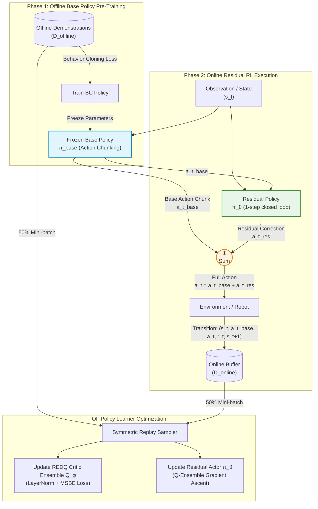
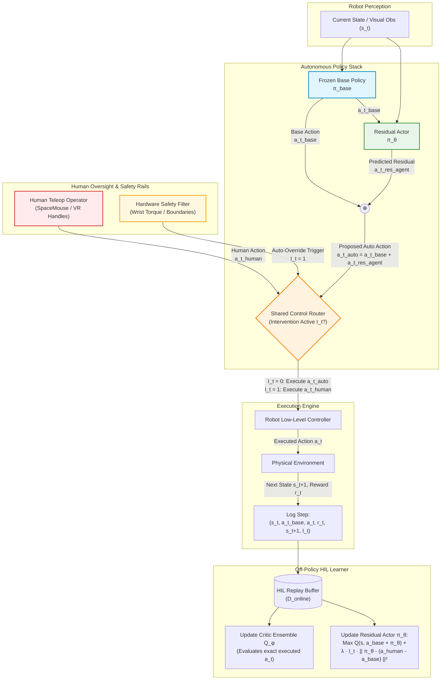

### Standard ResFiT Architecture Process

```mermaid
graph TD
    %% Subgraph Phase 1
    subgraph Phase1["Phase 1: Offline Base Policy Pre-Training"]
        D_demos[("Offline Demonstrations\n(D_offline)")] -->|Behavior Cloning Loss| BC_Train["Train BC Policy"]
        BC_Train -->|Freeze Parameters| BasePolicy["Frozen Base Policy\nπ_base (Action Chunking)"]
    end

    %% Subgraph Phase 2
    subgraph Phase2["Phase 2: Online Residual RL Execution"]
        Obs["Observation / State\n(s_t)"] --> BasePolicy
        Obs --> ResActor["Residual Policy\nπ_θ (1-step closed loop)"]
        
        BasePolicy -->|Base Action Chunk\na_t_base| Sum(("⊕\nSum"))
        BasePolicy -->|a_t_base| ResActor
        ResActor -->|Residual Correction\na_t_res| Sum
        
        Sum -->|Full Action\na_t = a_t_base + a_t_res| Env["Environment / Robot"]
        Env -->|"Transition: (s_t, a_t_base, a_t, r_t, s_t+1)"| Buffer[("Online Buffer\n(D_online)")]
    end

    %% Subgraph Training Loop
    subgraph Training["Off-Policy Learner Optimization"]
        D_demos -->|"50% Mini-batch"| Sampler["Symmetric Replay Sampler"]
        Buffer -->|"50% Mini-batch"| Sampler
        Sampler --> CriticUpdate["Update REDQ Critic Ensemble Q_φ\n(LayerNorm + MSBE Loss)"]
        Sampler --> ActorUpdate["Update Residual Actor π_θ\n(Q-Ensemble Gradient Ascent)"]
    end

    style BasePolicy fill:#e1f5fe,stroke:#0288d1,stroke-width:2px
    style ResActor fill:#e8f5e9,stroke:#388e3c,stroke-width:2px
    style Sum fill:#fff3e0,stroke:#f57c00,stroke-width:2px
```
---
### ResFiT with Human-In-The-Loop (HIL) Corrections

```mermaid
graph TD
    %% Observation Stage
    subgraph Perception["Robot Perception"]
        State["Current State / Visual Obs (s_t)"]
    end

    %% Autonomous Action Stack
    subgraph Autonomous["Autonomous Policy Stack"]
        BaseP["Frozen Base Policy\nπ_base"] -->|Base Action\na_t_base| AddAuto(("⊕"))
        State --> BaseP
        State --> ResP["Residual Actor\nπ_θ"]
        BaseP -->|a_t_base| ResP
        ResP -->|Predicted Residual\na_t_res_agent| AddAuto
        AddAuto -->|Proposed Auto Action\na_t_auto = a_t_base + a_t_res_agent| Router{"Shared Control Router\n(Intervention Active I_t?)"}
    end

    %% Human Supervision & Safety Controls
    subgraph HumanInput["Human Oversight & Safety Rails"]
        Operator["Human Teleop Operator\n(SpaceMouse / VR Handles)"] -->|Human Action\na_t_human| Router
        SafetyGuard["Hardware Safety Filter\n(Wrist Torque / Boundaries)"] -->|Auto-Override Trigger\nI_t = 1| Router
    end

    %% Control & World Execution
    subgraph Control["Execution Engine"]
        Router -->|I_t = 0: Execute a_t_auto\nI_t = 1: Execute a_t_human| RobotController["Robot Low-Level Controller"]
        RobotController -->|Executed Action a_t| PhysicalWorld["Physical Environment"]
        PhysicalWorld -->|Next State s_t+1, Reward r_t| TransitionLogger["Log Step:\n(s_t, a_t_base, a_t, r_t, s_t+1, I_t)"]
    end

    %% Off-Policy HIL Learning
    subgraph Learning["Off-Policy HIL Learner"]
        TransitionLogger --> ReplayBuffer[("HIL Replay Buffer\n(D_online)")]
        ReplayBuffer --> CriticOptimizer["Update Critic Ensemble Q_φ\n(Evaluates exact executed a_t)"]
        ReplayBuffer --> ActorOptimizer["Update Residual Actor π_θ:\nMax Q(s, a_base + π_θ) +\nλ · I_t · || π_θ - (a_human - a_base) ||²"]
    end

    style BaseP fill:#e1f5fe,stroke:#0288d1,stroke-width:2px
    style ResP fill:#e8f5e9,stroke:#388e3c,stroke-width:2px
    style Router fill:#fff3e0,stroke:#f57c00,stroke-width:2px
    style Operator fill:#ffebee,stroke:#d32f2f,stroke-width:2px
    style SafetyGuard fill:#fff8e1,stroke:#ffa000,stroke-width:2px
```
---