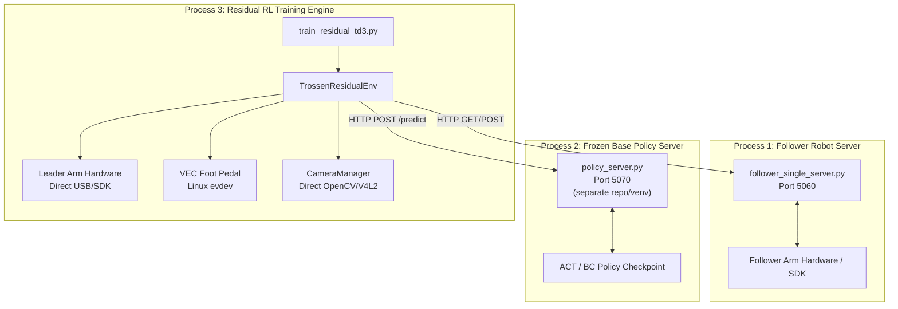
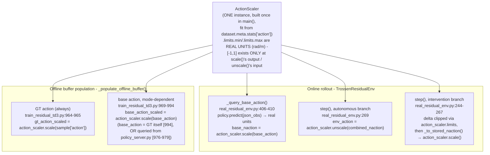
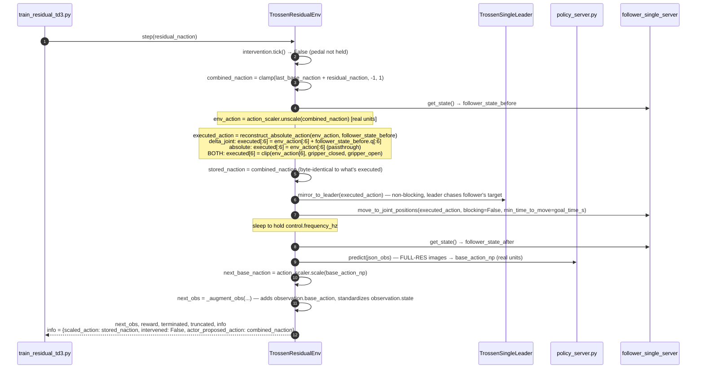
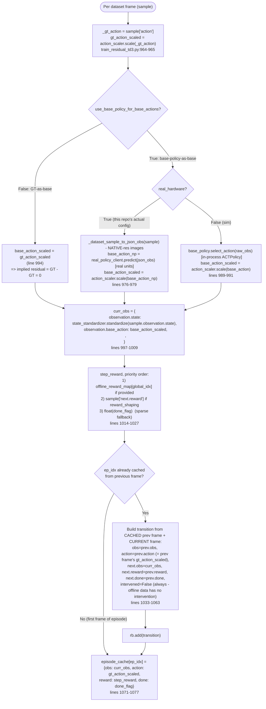

# Real-Hardware Residual RL Training & Intervention Architecture

Code-accurate reference for the real-hardware Residual RL (TD3) system with human intervention, on the Trossen platform. Every diagram/formula below cites the exact function and file it describes — nothing here is inferred or assumed. Line numbers are current as of this revision; re-check them if the cited files change.

Split into independently-referenceable diagram blocks (rather than one large diagram) so each one stays legible:

- §1 — Process topology
- §2 — Shared normalization pipeline (answers "where do base-policy actions get normalized, and is there a second remapping?")
- §3 — Online step, autonomous case
- §4 — Online step, human-intervention case
- §5 — Offline buffer population
- §6 — Replay buffer schema & persistence
- §7 — Diagnostic JSONL log schema
- §8 — Complete safety-clipping reference (every clamp in the system, in one table)

---

## 1. Overview & Launch Process

Training is launched via [`scripts/train_residual_rl_real.sh`](../scripts/train_residual_rl_real.sh), which invokes [`resfit/rl_finetuning/scripts/train_residual_td3.py`](../resfit/rl_finetuning/scripts/train_residual_td3.py) with `real_hardware=true`.

Three decoupled processes run concurrently:



1. **Follower Server** ([`trossen_real/follower/follower_single_server.py`](follower/follower_single_server.py)) — owns arm SDK commands at `http://127.0.0.1:5060`.
2. **Base Policy Server** (`policy_server.py`, a separate repo/venv) — serves the frozen ACT/BC checkpoint at `http://127.0.0.1:5070`. `/predict` returns the action **already in real units** (radians / meters) — confirmed by [`policy_client.py:94-110`](inference/policy_client.py#L94-L110)'s `predict_full()`, which labels the `"action"` field "the real-units one it actually acts on", separate from the diagnostic-only `"action_normalized"` field (the checkpoint's *own*, internal, opaque-to-this-repo normalization — never used for control here). Nothing in this repo ever sees or uses the checkpoint's internal normalization.
3. **Training Script** ([`train_residual_td3.py`](../resfit/rl_finetuning/scripts/train_residual_td3.py)) — runs the TD3 loop, owns `TrossenResidualEnv`, connects to leader hardware + foot pedal directly, populates the online and offline replay buffers.

---

## 2. Shared Normalization Pipeline

**This is the answer to "where does the base-policy action get normalized, and is it remapped a second time?"** — no, it is not. There is exactly **one** `ActionScaler` instance for the entire run, constructed once in `main()`:

```python
# resfit/rl_finetuning/scripts/train_residual_td3.py:394-399
action_scaler = ActionScaler.from_dataset_stats(
    action_stats=dataset.meta.stats["action"],           # dataset action min/max (7D)
    action_scale=cfg.agent.actor.action_scale,            # ACTION_SCALE from the .sh, e.g. [0.15]*6+[0.05]
    min_range_per_dim=cfg.offline_data.min_action_range,  # MIN_ACTION_RANGE, e.g. 0.1
    device=device,
)
```

That single object's `.scale()`/`.unscale()` methods are the *only* normalization ever applied to a real-unit action anywhere in this codebase — online rollout, offline buffer population, and human intervention all call the exact same instance. There is no second/different mapping anywhere.

**Does the `action_scale` expansion math itself work on real units, or already-normalized ones?** Real units, entirely. `ActionScaler.__init__` computes `_limits` (the min/max it clamps to, and maps `[-1,1]` to/from) using nothing but `action_min`/`action_max` (real units, straight from `dataset.meta.stats["action"]`) and the scalar `action_scale`/`min_range_per_dim` config values — no normalized quantity appears anywhere in this computation. Verbatim from the code (no paraphrase):

```python
# resfit/rl_finetuning/utils/normalization.py:69-84 (ActionScaler.__init__)
# Compute action center and half-range
action_mid = (action_min + action_max) / 2 # 7d array
action_half_range = (action_max - action_min) / 2 # 7d array

# Apply safeguard: ensure minimum range to prevent normalization blow-up
min_half_range = torch.tensor(min_range_per_dim / 2, device=self.device) # scalar. it is 0.1/2=0.05
action_half_range = torch.maximum(action_half_range, min_half_range) # 7d array

# Expand the range by action_scale factor
expanded_half_range = action_half_range * (1 + self.action_scale) # 7d array. it is [7D] * 1.2 = [7D]

# Store the final limits
self._limits = self.Limits(
    min=action_mid - expanded_half_range,
    max=action_mid + expanded_half_range,
)
```

`self._limits.min`/`.max` — the output of this block — **are themselves real-unit values** (radians for the 6 joints, meters for the gripper), same units as `action_min`/`action_max` went in. `[-1,1]` only exists on the *output* side of `.scale()` and the *input* side of `.unscale()` ([`normalization.py:102-121`](../resfit/rl_finetuning/utils/normalization.py#L102-L121) / [`123-141`](../resfit/rl_finetuning/utils/normalization.py#L123-L141)) — `_limits` itself never leaves real-unit space.

### 2.1 Three distinct concepts that must not be conflated

| # | Concept | What it is | Where it lives |
|---|---|---|---|
| (a) | The ACT checkpoint's own internal normalization | Opaque, external, belongs to `policy_server.py`'s training config | Never touches this repo — `/predict`'s `"action"` field is already real units by the time this repo sees it |
| (b) | `ActionScaler`'s `[-1, 1]` space | The **only** normalized space this repo's RL system (actor, critic, buffer) operates in | `resfit/rl_finetuning/utils/normalization.py` |
| (c) | `agent.actor.action_scale` (e.g. `±0.15`) | **Not a separate space.** A magnitude cap on the residual actor's own `Tanh` output, *within* space (b) | `resfit/rl_finetuning/off_policy/rl/actor.py:118-124,181` |

`agent.actor.action_scale` happens to feed **two different mechanisms** with the same numeric config value — the `ActionScaler.__init__` formula above is one of them (expands the dataset's real-unit range into `_limits`); the other is the residual actor's own output, which never touches `ActionScaler` at all:

```python
# resfit/rl_finetuning/off_policy/rl/actor.py:181 - bounds what the RESIDUAL ACTOR can
# output, directly in NORMALIZED units - no ActionScaler call anywhere in this line
scaled_mu = tanh(net_out) * self.action_scale_tensor   # e.g. residual ∈ [-0.15, +0.15] around base_naction
```

`ActionScaler.limits` bounds the **entire achievable combined-action space** (real-unit image of the full `[-1,1]` box), not just the region near `base_naction` — `combined_naction = clamp(base + residual, -1, 1)` can legitimately reach anywhere in that full box (e.g. whenever `base_naction` is already near an edge). The `±action_scale` band on the actor's own output is strictly narrower and only constrains what the actor itself can produce.

### 2.2 Worked numeric example — proves there is only one shared mapping

Concrete numbers, generated by actually running this repo's `ActionScaler` (not hand-computed) — one joint dimension, made-up-but-realistic per-frame delta stats `action_min=-0.06 rad`, `action_max=+0.06 rad`, `action_scale=0.15`, `min_range_per_dim=0.1`:

```
limits.min = -0.069,  limits.max = +0.069   (computed ONCE at startup, from dataset stats — §2 formula)

Step A — base BC action arrives from policy_server.py, REAL units:
    base_action_real = 0.03 rad
    base_naction = action_scaler.scale(base_action_real) = 0.4348      <- normalized ONCE, stored in obs, done

Step B — RL actor's raw output (NO ActionScaler call anywhere in this step):
    tanh_out = 0.6                              (network's raw output, already ∈ [-1,1])
    residual_naction = tanh_out * action_scale = 0.6 * 0.15 = 0.09

Step C — combine in NORMALIZED space (a CLAMP, not a rescale), then unnormalize:
    combined_naction = clamp(base_naction + residual_naction, -1, 1) = clamp(0.5248, -1, 1) = 0.5248
    env_action_real  = action_scaler.unscale(combined_naction) = 0.0362 rad   <- SAME action_scaler, SAME limits

Round-trip proof (the SAME instance, so this must hold exactly, and does):
    action_scaler.unscale(action_scaler.scale(0.03)) = 0.030000...rad
```

Two things this proves directly: (1) `base_naction` (`0.4348`) is computed once in Step A and never touched again — the `[-1,1]` clamp in Step C acts only on the *sum*, cutting it off at the boundary if it overflows, which is a fundamentally different operation from a rescale (a clamp cuts off; a rescale stretches/compresses the whole range); (2) if Step A's `scale()` and Step C's `unscale()` used different stats, the round-trip check would not return `0.03` exactly — it does, because both calls hit the identical `self._limits` on the identical `action_scaler` object.

### 2.3 The one shared pipeline, all four call sites



Same object, same `.scale()`/`.unscale()` clamp behavior, in every one of the 4 call sites above — this is why there is no "remapping": whatever real-unit action any of these paths produces goes through the identical `[action_scaler.limits.min, action_scaler.limits.max] <-> [-1,1]` linear map.

---

## 3. Online Step — Autonomous Case (`intervened_now == False`)



Exact code: [`real_residual_env.py:209-355`](rl/real_residual_env.py#L209-L355) (`step()`, full function — shared by both cases), [`policy_client.py:162-221`](inference/policy_client.py#L162-L221) (`reconstruct_absolute_action`). `mirror_to_leader()` ([`intervention.py:136-142`](inference/intervention.py#L136-L142)) always drives the **leader to track the follower** (never the other way) — the follower is the master, so a human resting a hand on the leader feels the autonomous motion coming, and the leader stays near the follower for a smooth future takeover.

---

## 4. Online Step — Human Intervention Case (`intervened_now == True`)

The RL actor's `residual_naction` is still evaluated every tick (never skipped) — `combined_naction` is computed and returned as `info["actor_proposed_action"]` for diagnostics, but **discarded**, never executed or stored, while intervened.

**Everything below is one single chart** — the full `step()` call for one tick, `intervention.tick()`'s edge detection, the exact clamp math with exact station1 values, execution, storage, and the loop-back that shows what happens across consecutive held ticks — all in one place, flowchart syntax throughout (every label is an explicitly quoted string) so there's no ambiguity for the renderer:

```mermaid
flowchart TD
    Start(["step(residual_naction) called<br/>runs EVERY tick, autonomous or intervened<br/>real_residual_env.py:209"]) --> ReadPedal["intervened_now = pedal.is_intervention()<br/>intervention.py:78"]

    ReadPedal --> ReleaseCheck{"self._prev_intervened == True<br/>AND intervened_now == False ?<br/>(RELEASE edge, intervention.py:80)"}
    ReleaseCheck -->|"yes"| PolicyReset["policy.reset()<br/>flushes policy_server.py's action-chunk queue<br/>intervention.py:81-82<br/>fires EXACTLY ONCE per intervention episode"]
    ReleaseCheck -->|"no"| ModeSwitch
    PolicyReset --> ModeSwitch{"intervened_now ?"}

    ModeSwitch -->|"True"| Freedrive["leader.set_freedrive_mode()<br/>no-op if already freedrive<br/>trossen_leader_single.py:98-103"]
    ModeSwitch -->|"False"| Position["leader.set_position_mode()<br/>no-op if already position<br/>trossen_leader_single.py:105-110<br/>-- goes to §3 autonomous branch, not shown further here"]

    Freedrive --> SetPrevTrue["self._prev_intervened = True<br/>return intervened_now = True<br/>intervention.py:89-90"]

    SetPrevTrue --> ComputeCombined["combined_naction = clamp(last_base_naction + residual_naction, -1, 1)<br/>real_residual_env.py:223<br/>ALWAYS computed even though about to be discarded"]
    ComputeCombined --> ReadFollower["follower_state_before = follower.get_state()<br/>real_residual_env.py:224"]
    ReadFollower --> ReadLeader["leader_joints = leader.get_joint_positions()<br/>real_residual_env.py:244<br/>RAW absolute 7D readback: 6 joints (rad) + gripper (m)"]

    ReadLeader --> ComputeBounds["delta_min = action_scaler.limits.min[:6]<br/>delta_max = action_scaler.limits.max[:6]<br/>real_residual_env.py:246-247<br/>the SAME bound §2/§8#4 uses for EVERY autonomous step too<br/>-- illustrative example values (§2.2): -0.069 / +0.069 rad<br/>-- actual values are dataset-specific, not fabricated here"]

    ComputeBounds --> SpaceCheck{"self.action_space_name ?<br/>real_residual_env.py:250"}
    SpaceCheck -->|"delta_joint<br/>(this repo's actual configured value,<br/>REAL_ACTION_SPACE in train_residual_rl_real.sh)"| DeltaBranch["raw_delta = leader_joints[:6] - follower_state_before['q'][:6]<br/>clamped_delta = clip(raw_delta, delta_min, delta_max)<br/>executed_action[:6] = follower_state_before['q'][:6] + clamped_delta<br/>real_residual_env.py:251-253"]
    SpaceCheck -->|"absolute"| AbsBranch["executed_action[:6] = clip(leader_joints[:6], delta_min, delta_max)<br/>real_residual_env.py:255<br/>no addition of follower state -- target IS the absolute value"]

    DeltaBranch --> GripperClip
    AbsBranch --> GripperClip
    GripperClip["executed_action[6] = clip(leader_joints[6], gripper_closed, gripper_open)<br/>real_residual_env.py:261<br/>station1 config: gripper_closed=0.004 m, gripper_open=0.04 m"]

    GripperClip --> StoreAction["stored_naction = _to_stored_naction(executed_action, follower_state_before)<br/>real_residual_env.py:267, method body at 419-429<br/>re-derives the SAME delta just computed, then action_scaler.scale()<br/>-- that clamp is now a no-op (value already inside bound)<br/>result: BYTE-IDENTICAL to executed_action, up to fp rounding"]

    StoreAction --> Move["follower.move_to_joint_positions(executed_action,<br/>blocking=False, min_time_to_move=goal_time_s)<br/>real_residual_env.py:278-280<br/>-- this call is OUTSIDE the if/else, identical for both branches<br/>station1: goal_time_s = goal_time_multiplier / frequency_hz = 2.5 / 20 = 0.125 s"]

    Move --> NoLeaderCmd["LEADER IS NOT COMMANDED HERE<br/>still in freedrive, physically backdriven by the human<br/>mirror_to_leader() is ONLY called in the autonomous branch (§3)"]

    NoLeaderCmd --> Sleep["sleep(max(0, 1/frequency_hz - elapsed))<br/>real_residual_env.py:283-285<br/>station1: frequency_hz=20, target tick period = 50 ms"]

    Sleep --> NextObs["follower_state_after = follower.get_state()<br/>next_base_naction = action_scaler.scale(policy.predict(json_obs))<br/>next_obs = _augment_obs(...)<br/>real_residual_env.py:287-292 -- IDENTICAL to autonomous branch, §3"]

    NextObs --> BuildInfo["info = dict(<br/>  scaled_action = stored_naction,<br/>  intervened = True,<br/>  actor_proposed_action = combined_naction,<br/>)<br/>real_residual_env.py:314-318<br/>combined_naction kept ONLY for diagnostics -- never trained on, never stored in the buffer"]

    BuildInfo --> ReturnStep(["return next_obs, reward, terminated, truncated, info<br/>to train_residual_td3.py"])

    ReturnStep -.->|"next tick, if pedal STILL held<br/>(§4.2's held-tick table shows the numeric<br/>follower-catches-up-to-leader convergence<br/>this loop produces)"| ReadPedal
    ReturnStep -.->|"next tick, if pedal released:<br/>RELEASE edge fires above, autonomous branch (§3) resumes"| ReadPedal
```



### 4.1 Why the clamp exists (fixed in this revision)

Before this revision, `executed_action[:6]` was the **raw, unclamped** leader readback — freedrive has no software rate limit, and nothing downstream clamps the 6 arm joints either (`FollowerClient.move_to_joint_positions` → `follower_single_server.py` → `follower_single.py::goal_joint()`, whose own docstring states *"the caller is responsible for any safety clamp on the 6 arm joints"* → the raw SDK `set_all_positions(goal_time=...)` call, which attempts whatever delta it's given within `goal_time_s` regardless of magnitude). Meanwhile `_to_stored_naction()` *did* clamp (via `action_scaler.scale()`'s internal clamp) — so a fast human motion could execute a large physical delta while storing a smaller, clamped one, silently breaking the "stored action == executed action" invariant the buffer depends on.

The fix clamps `executed_action` itself, at the source, to `action_scaler.limits` — the exact same real-unit bound that already governs every autonomous step (via `unscale()`'s own clamp). Net effect: while the pedal is held, the follower **rate-limits toward the leader** rather than snapping to it — each tick it moves at most `action_scaler.limits`'s per-dimension range toward wherever the leader currently is, catching up over subsequent ticks if the human moves faster than that.

### 4.2 Full multi-tick dynamics: press → hold → release

§3/§4's diagrams show one representative tick each. This section shows what actually happens **across consecutive ticks** — the part that's easy to get wrong, since `intervention.tick()` runs unconditionally at the top of *every* `step()` call, autonomous or not, and its behavior depends on state carried from the previous tick (`self._prev_intervened`).

Exact logic, verbatim from [`intervention.py:63-90`](inference/intervention.py#L63-L90) (`InterventionManager.tick()`), called once per `step()`, before anything else:

```python
def tick(self) -> bool:
    intervened_now = self.pedal.is_intervention()
    if self._prev_intervened and not intervened_now:      # RELEASE edge only
        self.policy.reset()
    if intervened_now:
        self.leader.set_freedrive_mode()                  # no-op if already freedrive
    else:
        self.leader.set_position_mode()                   # no-op if already position
    self._prev_intervened = intervened_now
    return intervened_now
```

`set_freedrive_mode()`/`set_position_mode()` ([`trossen_leader_single.py:98-110`](leader/trossen_leader_single.py#L98-L110)) are themselves idempotent (`if self._current_mode == "freedrive": return`, etc.) — so calling them every tick regardless of edge is cheap and safe, not a real mode-switch each time. The chart above already encodes the full press → hold → release state machine via its `ReleaseCheck`/`ModeSwitch` branches and its two loop-back edges (`ReturnStep` back to `ReadPedal`) — no separate state diagram needed.

Two things this makes explicit that are easy to miss from a single-tick view alone:

- **There is no separate "transition tick" where nothing happens.** The tick where the pedal is first detected pressed already executes the intervention branch (§4) in full; the tick where release is detected already executes the autonomous branch (§3) in full, `policy.reset()` and all. No tick is ever "wasted" switching modes.
- **`policy.reset()` fires exactly once per intervention episode**, on the release edge only — never on press, never on any of the held ticks in between (guarded by `self._prev_intervened and not intervened_now`, which is only true on that one transition).

**Concrete numeric walkthrough of the "held" ticks** — this is what actually makes the rate-limiting in §4.1 real, not just an assertion. Say the operator grabs the leader and instantly moves it `0.30 rad` away from the follower on one joint, then **holds** the pedal (and that position) for several ticks. Using this repo's exact clamp formula (§4.1/§8#7) with `action_scaler.limits = [-0.069, +0.069]` rad for this dim (§2.2's worked example — same numbers, for continuity):

| Tick | `raw_delta = leader_q - follower_q_before` | `clamped_delta` | `follower_q` after this tick |
|---|---|---|---|
| 1 | `+0.3000` | `+0.0690` (clamped — exceeds bound) | `0.1000 → 0.1690` |
| 2 | `+0.2310` | `+0.0690` (clamped) | `0.1690 → 0.2380` |
| 3 | `+0.1620` | `+0.0690` (clamped) | `0.2380 → 0.3070` |
| 4 | `+0.0930` | `+0.0690` (clamped) | `0.3070 → 0.3760` |
| 5 | `+0.0240` | `+0.0240` (**not** clamped — already inside bound) | `0.3760 → 0.4000` (converged) |

(Generated by running the actual clamp formula, not hand-computed — see verification note in §9.) At `control.frequency_hz = 20` (§8, station1), that's `4 × 50ms ≈ 200ms` of visible lag before the follower catches up to a `0.30 rad` grab, then exact convergence on tick 5. If the human keeps moving the leader continuously (not holding still), the follower simply keeps chasing at this same bounded per-tick rate — it never "snaps", only ever closes the gap by at most `action_scaler.limits`'s range each tick, indefinitely, for as long as the pedal is held.

**Release, immediately after tick 5 above**: on the next tick, `pedal.is_intervention()` reads `False`. `intervention.tick()` sees `self._prev_intervened=True, intervened_now=False` → calls `policy.reset()` → switches leader to position mode. The *same* `step()` call then runs the autonomous branch (§3): fresh `base_naction`/`residual_naction` computed from the follower's current (now leader-matched) state, `combined_naction` executed, and `mirror_to_leader()` starts driving the leader from wherever the human left it (`0.40` in this example) toward that fresh autonomous target — non-blocking, over `goal_time_s`. No separate leader-resync step exists or is needed here: because the clamp makes the follower converge to the leader *during* the held ticks (as shown above), the gap `mirror_to_leader()` has to close on release is typically small or zero by the time release happens — this is a direct, mechanical consequence of the tick-by-tick convergence above, not a separately-coded behavior.

---

## 5. Offline Buffer Population — `_populate_offline_buffer()`

Fills `offline_rb` once at startup, from the LOCAL demo dataset (`OFFLINE_DATASET`/`OFFLINE_DATASET_ROOT`), before online training starts. Undocumented until this revision — this is the second half of the same shared-`ActionScaler` pipeline in §2.



Key facts, stated precisely (no rounding/simplification):

- **The stored `action` is always the dataset's ground-truth action** (`gt_action_scaled`), in *both* modes — the mode only changes what `observation.base_action` is set to. This means the implied residual (`action - obs["observation.base_action"]`) is exactly `0` in GT-as-base mode, and `GT - base_policy_prediction` in base-policy mode.
- Real hardware uses the base-policy mode's **real** branch — `real_policy_client` is the *same* `PolicyClient`/`env.policy` object live rollout already uses, queried over HTTP with native-resolution images (the dataset is loaded *without* a resize transform specifically for this — resize is applied *after* the query, per-sample, via `post_resize`, right before storage — see [`train_residual_td3.py:356-367`](../resfit/rl_finetuning/scripts/train_residual_td3.py#L356-L367), wired into the call at [`train_residual_td3.py:1251-1252`](../resfit/rl_finetuning/scripts/train_residual_td3.py#L1251-L1252)).
- `state_standardizer` (also a single shared instance, fit once alongside `action_scaler`) is the same object used online — confirmed at [`train_residual_td3.py:402-406`](../resfit/rl_finetuning/scripts/train_residual_td3.py#L402-L406) vs. [`real_residual_env.py:412-417`](rl/real_residual_env.py#L412-L417) (`_augment_obs`'s `state_standardizer.standardize(...)` call).
- `_dataset_sample_to_json_obs()` ([`train_residual_td3.py:873-898`](../resfit/rl_finetuning/scripts/train_residual_td3.py#L873-L898)) zero-fills the auxiliary `joint_pos_raw`/`ee_pose_raw`/`velocity`/`effort`/`acceleration` observation keys — confirmed inert for ACT (only `observation.state` is actually read, per `modeling_act.py`), so this has no effect on the predicted base action.
- Offline transitions get `"intervened": torch.tensor(False, ...)` explicitly ([`train_residual_td3.py:1048`](../resfit/rl_finetuning/scripts/train_residual_td3.py#L1048)) — **required**, not cosmetic: `torch.cat([online_batch, offline_batch])` (the mixed-batch training step) needs both TensorDicts to have an identical key set, or `tensordict` raises a `KeyError` at every training step whenever `offline_fraction > 0` (verified empirically; this was a real regression introduced and caught while adding the `intervened` field to the online buffer, fixed in the same revision).

---

## 6. Replay Buffer Schema & Persistence

### 6.1 Per-transition schema (`_add_transitions_to_buffer()`, online — [`train_residual_td3.py:162-226`](../resfit/rl_finetuning/scripts/train_residual_td3.py#L162-L226))

| Field | Source | Notes |
|---|---|---|
| `obs` / `next.obs` | `TrossenResidualEnv`'s obs dict, filtered to `image_keys ∪ lowdim_keys` | `lowdim_keys = ["observation.state", "observation.base_action"]` ([line 708](../resfit/rl_finetuning/scripts/train_residual_td3.py#L708)) — base BC action **is** retained per-transition |
| `action` | `info["scaled_action"]` = `stored_naction` | Combined/executed action, whether autonomous or human-overridden — never a bare residual |
| `intervened` | `info.get("intervened", False)` | **New in this revision.** `bool`. Always `False` for sim (no such concept there) |
| `next.reward` / `next.done` / `next.terminated` | env `step()` return values | — |
| `_priority` | fixed `10.0` seed | Initial priority for prioritized sampling |

**Not stored**: `info["actor_proposed_action"]` — never read by `_add_transitions_to_buffer()`, exists purely for the diagnostic JSONL log (§7).

### 6.2 Offline schema (`_populate_offline_buffer()`)

Identical shape (`obs`, `action`, `intervened`, `next.{obs,reward,done,terminated}`, `_priority`) — required so the two buffers can be `torch.cat`'d for mixed batches (§5). `action` is the dataset GT action (not "combined" in the online sense, since there's no residual actor acting during offline population).

### 6.3 Persistence — three dump points, all real-hardware only

| When | Path | Purpose | Code |
|---|---|---|---|
| Once, right after warm-up finishes | `ONLINE_CACHE_DIR/<config-hash>/` (`{CACHE_DIR}/online_buffer_cache/<hash>`) | Cache-reuse: an identical-config rerun can skip re-collecting warm-up steps | [`train_residual_td3.py:1357-1358`](../resfit/rl_finetuning/scripts/train_residual_td3.py#L1357-L1358) |
| Every `save_freq` steps, alongside checkpointing (real hardware only) | `run_cache_dir/online_buffer_latest/` | Crash safety net — overwritten each time | [`train_residual_td3.py:1981-1983`](../resfit/rl_finetuning/scripts/train_residual_td3.py#L1981-L1983) (new) |
| End of training (real hardware only) | `run_cache_dir/online_buffer_final/` | Full post-hoc inspection of the entire run's real transitions | [`train_residual_td3.py:2234-2237`](../resfit/rl_finetuning/scripts/train_residual_td3.py#L2234-L2237) (new) |

`run_cache_dir = {CACHE_DIR:-.}/run_<timestamp>_<run_name>` ([`train_residual_td3.py:1423`](../resfit/rl_finetuning/scripts/train_residual_td3.py#L1423)); preserved (not cleaned up) whenever `NO_CLEANUP=true`, which the real-hardware `.sh` sets by default.

All three use `optimized_replay_buffer_dumps()` ([`resfit/rl_finetuning/utils/hugging_face.py:103-116`](../resfit/rl_finetuning/utils/hugging_face.py#L103-L116)), a thin wrapper over torchrl's `ReplayBuffer.dumps()` — a memmap-`TensorDict` format. `scripts/inspect_replay_buffer.py` (renamed/generalized from the old offline-only `scripts/temp/inspect_offline_buffer.py`) works for any of these caches — point it at any of the three paths above to inspect `obs["observation.base_action"]`, `action`, `intervened`, rewards, etc. directly.

---

## 7. Diagnostic JSONL Log (`real_env_diagnostic_log.jsonl`)

Configured via `REAL_LOG_FILE` (default-on in `train_residual_rl_real.sh`), written by `TickLogger` ([`policy_client.py:28-72`](inference/policy_client.py#L28-L72)) from inside `TrossenResidualEnv.step()` ([`real_residual_env.py:320-334`](rl/real_residual_env.py#L320-L334)) — one JSONL line per control tick. **Never read back by training** — purely for offline inspection (`jq`/`pandas`), and self-disabling on write failure (never crashes the control loop).

| Key | Type | Meaning |
|---|---|---|
| `wall_time` | `float` | Unix timestamp, auto-added by `TickLogger.log()` |
| `step` | `int` | `self._step_count` within the current episode |
| `intervened` | `bool` | This tick's `intervened_now` |
| `reward` | `float` | `pedal.consume_reward_latched()` — `1.0` if the reward pedal was pressed *at any point* since the last tick (latched, not just level-read) |
| `terminated` | `bool` | `pedal.consume_reset()` |
| `truncated` | `bool` | `step_count >= max_steps` |
| `executed_action` | `list[float]`, len 7 | **Physically sent to the follower.** Autonomous: `reconstruct_absolute_action(unscale(combined_naction), follower_state_before)`. Intervention: the **clamped** leader-tracking target (§4) — as of this revision, no longer the raw leader readback |
| `stored_naction` | `(1,7)` | `info["scaled_action"]`. Autonomous: `combined_naction`. Intervention: `_to_stored_naction(executed_action, ...)` — now byte-identical (up to fp rounding) to `executed_action`'s delta, since both derive from the same clamped value |
| `actor_proposed_action` | `(1,7)` | `combined_naction`, always computed, diagnostic-only — equals `stored_naction` in autonomous mode; during intervention it's what the RL agent *would* have done, discarded |
| `residual_naction` | `(1,7)` | Raw actor output this tick, `∈ [-action_scale, +action_scale]`. Always computed, even while intervened (its result is simply unused that tick) |
| `follower_state_before` / `_after` | `dict` | `q`, `dq`, `efforts`, `pose`, `gripper_pos`, before/after this tick's move |
| `achieved_hz` | `float` | `1.0 / elapsed_time` for this tick (target: `control.frequency_hz`) |

---

## 8. Complete Safety-Clipping Reference

Every clamp/clip in the real-hardware pipeline, exact source and current numeric values. Formulas in real units unless noted.

| # | Clip | Formula | Where | Current values (station1 + `train_residual_rl_real.sh`) |
|---|---|---|---|---|
| 1 | `combined_naction` clamp | `clamp(base_naction + residual_naction, -1, 1)` | [`real_residual_env.py:223`](rl/real_residual_env.py#L223) | Normalized `[-1, 1]`, dimensionless |
| 2 | `ActionScaler.scale()` clamp | Real-unit input clamped to `[limits.min, limits.max]` before mapping to `[-1,1]` | [`normalization.py:102-121`](../resfit/rl_finetuning/utils/normalization.py#L102-L121) | `limits` = per-dim, see #4 |
| 3 | `ActionScaler.unscale()` clamp | Normalized input clamped to `[-1,1]` before mapping to real units | [`normalization.py:123-141`](../resfit/rl_finetuning/utils/normalization.py#L123-L141) | — |
| 4 | `ActionScaler.limits` (the bound #2/#3 map to/from) | `mid ± (half_range floored at min_range_per_dim/2) × (1+action_scale)`, per-dim; `mid`/`half_range` from `dataset.meta.stats["action"]` | [`normalization.py:70-84`](../resfit/rl_finetuning/utils/normalization.py#L70-L84) | `action_scale = [0.15]×6 + [0.05]`, `min_range_per_dim = 0.1` (config values — actual `limits.min/max` are dataset-specific, computed from `OFFLINE_DATASET`'s stats; not knowable without inspecting `dataset.meta.stats["action"]` directly) |
| 5 | Residual actor's own output cap | `scaled_mu = tanh(net_out) * action_scale_tensor` | [`actor.py:118-124,181`](../resfit/rl_finetuning/off_policy/rl/actor.py#L181) | Same `[0.15]×6 + [0.05]` vector, but a **narrower, different-purpose** bound than #4 — see §2.1 |
| 6 | Gripper clip (both branches) | `clip(gripper_value, gripper_closed, gripper_open)` | Autonomous: [`policy_client.py:218-220`](inference/policy_client.py#L218-L220) (`reconstruct_absolute_action`'s `gripper_bounds`). Intervention: [`real_residual_env.py:261`](rl/real_residual_env.py#L261) | `trossen_station1_single.yaml`: `gripper_open=0.04`, `gripper_closed=0.004` (overrides `ControlConfig`'s dataclass defaults of `0.04`/`0.009`) |
| 7 | **Intervention arm-joint delta clamp (new this revision)** | `delta_joint`: `clip(leader_q[:6] - follower_q_before[:6], limits.min[:6], limits.max[:6])`, then `+ follower_q_before[:6]`. `absolute`: `clip(leader_q[:6], limits.min[:6], limits.max[:6])` directly | [`real_residual_env.py:244-255`](rl/real_residual_env.py#L244-L255) | Same `limits` as #4 — deliberately reused, not a separate bound |
| 8 | `joint_max_relative_target` (0.5 rad) | `clip(leader_joints[:6] - current_joints[:6], ±target)` | [`control_loop.py:266-282`](teleop/control_loop.py#L266-L282) | **Not applied anywhere in the RL/`TrossenResidualEnv` path** (autonomous or intervention) — confirmed by repo-wide grep, only referenced inside the separate pure-teleop `control_loop.py`. Listed here only to make clear it is *not* a live safety net for training |
| 9 | `absolute_mode_max_speed_m_s` (0.3 m/s) | `goal_time = max(goal_time_s, jump_dist / speed)` | [`control_loop.py:319-328`](teleop/control_loop.py#L319-L328) | Only applies to `command_space: ee` + `control_mode: absolute` — **not relevant here**: this station uses `command_space: joint` |

**Consequence of #2 + #7 together**: for intervention specifically, the executed and stored actions are now guaranteed to be the same value (up to float rounding) — see §4.1 for why this matters for critic correctness.

---

## 9. Verification & Audit Notes

- **Image resolution separation**: base-policy queries (`_query_base_action()`, `_dataset_sample_to_json_obs()`) always use full-resolution camera frames; RL-facing observations (`_build_actor_obs()`) are downsized to `rl_image_size` (`= offline_data.image_size`, e.g. 84×84) via bilinear + antialias interpolation before storage — one config field (`IMAGE_SIZE`) drives both the online and offline buffer's resolution, so they can't drift apart.
- **Two structural bugs found and fixed in this revision** (both verified, not assumed):
  1. Intervention's `executed_action` was unclamped while `stored_naction` was clamped — stored/executed mismatch, fixed via §4/§8#7.
  2. Adding the `intervened` field only to the online buffer's schema broke `torch.cat([online_batch, offline_batch])` (`KeyError`, empirically reproduced) whenever `offline_fraction > 0` — fixed by mirroring the field (always `False`) into `_populate_offline_buffer()`'s transitions too (§5, §6.2).
- **Leader-follower direction**: confirmed the follower is always the master outside of intervention — `mirror_to_leader()` drives the leader to the follower's target every non-intervened tick, never the reverse.
- **Numeric walkthroughs are generated, not hand-computed**: both §2.2's normalization round-trip and §4.2's 5-tick convergence table were produced by actually running this repo's `ActionScaler`/clamp formula in a Python shell against made-up-but-realistic inputs (not real dataset numbers, and not asserted from memory) — reproducible by anyone with this repo's venv.
